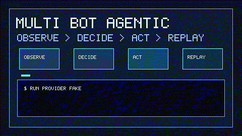

# multi-bot-agentic

`multi-bot-agentic` is a standalone AI-agent engineering showcase: a deterministic agent coordinator with explicit **Observe -> Decide -> Act** loops, durable event logs, rationale traces, provider adapters, and bounded safety controls.

It is built as a portfolio-quality recreation of the `multi-bot` product idea without depending on private infrastructure. The default path runs fully offline with a deterministic fake provider. Real adapters are included for OpenAI GPT, Claude Code CLI, Gemini, and Kimi/Moonshot.



## Why It Exists

Most agent demos let the LLM decide everything. This repo takes the production-minded path:

1. The LLM is an input source, not the control plane.
2. A deterministic decision engine chooses actions.
3. Every decision has a rationale trace.
4. Every lifecycle transition is persisted.
5. Every external integration goes through an adapter.
6. Safety controls bound scope, runtime, tools, and cancellation.

## Architecture At A Glance

```text
Goal
  |
  v
Observe  -> durable observation event
  |
  v
Decide   -> deterministic rule + rationale trace
  |
  v
Act      -> LLM adapter or allowlisted tool
  |
  v
Event log + replay
```

## Quick Demo

```bash
python -m venv .venv
. .venv/bin/activate
python -m pip install -e ".[dev]"
ruff check .
ruff format --check .
mypy src tests
pytest
multi-bot-agentic run --goal "Create a launch checklist for an AI agent platform" --provider fake
```

Replay the durable event log:

```bash
multi-bot-agentic replay --event-log data/runs.sqlite
```

## What This Showcases

- Explicit Observe -> Decide -> Act runtime loop.
- Deterministic decision engine with rationale traces.
- State-machine lifecycle: created, observing, deciding, acting, succeeded, failed, cancelled.
- Durable sqlite event log with replay.
- LLM adapters for OpenAI GPT, Claude Code CLI, Gemini, and Kimi/Moonshot.
- Tool adapters with allowlisted execution.
- Safety controls for max steps, prompt bounds, cancellation, and timeouts.
- Production-minded layout: `src/`, `tests/`, `scripts/`, `migrations/`, `.github/workflows/`, env config, docs.

## Providers

| Provider | Adapter | Live credential |
| --- | --- | --- |
| Fake | deterministic local provider | none |
| GPT / OpenAI | `OpenAIAdapter` | `OPENAI_API_KEY` |
| Claude Code | `ClaudeCodeCLIAdapter` | local `claude` command |
| Gemini | `GeminiAdapter` | `GEMINI_API_KEY` |
| Kimi / Moonshot | `KimiAdapter` | `KIMI_API_KEY` |

All adapters normalize output into `ModelOutput`. The runner consumes that output as an observation before the decision engine selects the next action.

## Repository Layout

```text
src/multi_bot_agentic/   runtime, lifecycle, decision engine, event log, adapters
tests/                   deterministic unit and integration tests
scripts/                 demo and verification scripts
migrations/              sqlite schema scaffold
docs/                    architecture, safety, config, quickstart, demo
.github/workflows/       CI for lint, format, typecheck, tests, demo smoke
```

## Documentation

- [Quickstart](docs/QUICKSTART.md)
- [Configuration](docs/CONFIGURATION.md)
- [Safety](docs/SAFETY.md)
- [Architecture](docs/ARCHITECTURE.md)

## Verification

```bash
ruff check .
ruff format --check .
mypy src tests
pytest
scripts/run_demo.sh
```

The CI workflow runs the same checks on Python 3.10, 3.11, and 3.12.

## Visual Asset

The README GIF is reproducible:

```bash
python scripts/render_demo_gif.py
```

The repo also keeps `docs/demo.svg` as a static architecture card.
