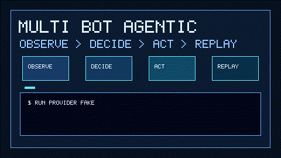

# multi-bot-agentic

`multi-bot-agentic` is a standalone AI-agent engineering showcase: a deterministic agent coordinator with explicit **Observe -> Decide -> Act** loops, durable event logs, rationale traces, provider adapters, and bounded safety controls.

It is built as a portfolio-quality recreation of the `multi-bot` product idea without depending on private infrastructure. The default path runs fully offline with a deterministic fake provider. Real adapters are included for GPT-5.5/OpenAI-compatible models, Claude Sonnet 4.6 via Claude Code CLI, Gemini 3.x, and Kimi K2/Moonshot.



## Why It Exists

Most agent demos let the LLM decide everything. This repo takes the production-minded path:

1. The LLM is an input source, not the control plane.
2. A deterministic decision engine chooses actions.
3. Every decision has a rationale trace.
4. Every lifecycle transition is persisted.
5. Every external integration goes through an adapter.
6. Safety controls bound scope, runtime, tools, and cancellation.

## Use Cases: Issues This Solves

### 1. "My agent did something, but I cannot explain why."

LLM-first agents often skip straight from prompt to action. When something goes wrong, the transcript may show what the model said, but not which control rule allowed the action.

`multi-bot-agentic` writes every decision as a durable event with a `RationaleTrace`: rule id, observations used, rejected actions, and explanation. You can replay the run later and inspect exactly why the engine chose `call_llm`, `call_tool`, `finish`, or `cancel`.

```bash
multi-bot-agentic replay --event-log data/runs.sqlite --event-type decision --format text
```

### 2. "I want to use AI agents, but I do not want the model directly executing tools."

Many agent frameworks let the model choose and invoke tools directly. That is convenient, but risky for production workflows where tool access should be explicit, bounded, and auditable.

This repo treats model output as an observation. The deterministic decision engine interprets constrained text like `TOOL:checklist:<payload>`, checks the safety policy, and only then executes an allowlisted tool adapter.

### 3. "I need the same agent flow to work with GPT-5.5, Claude Sonnet 4.6, Gemini 3.x, and Kimi K2."

Provider-specific SDKs and response shapes make agent code hard to port. A prototype built around one model often leaks provider details into the orchestration layer.

`multi-bot-agentic` normalizes providers behind one adapter interface:

- `OpenAIAdapter` for GPT-5.5/OpenAI-compatible chat completions.
- `ClaudeCodeCLIAdapter` for local Claude Code CLI workflows with Claude Sonnet 4.6.
- `GeminiAdapter` for Gemini 3.x `generateContent`.
- `KimiAdapter` for Moonshot/Kimi K2 chat completions.
- `FakeLLMAdapter` for deterministic CI and demos.

The runner consumes all provider responses as `ModelOutput`, so orchestration logic stays provider-neutral.

### 4. "I need a safe demo path that does not require API keys."

Portfolio and CI demos should not depend on live model credentials, model availability, or network behavior.

The fake provider produces deterministic model-like outputs that the real runtime consumes. It still exercises Observe -> Decide -> Act, tool routing, safety checks, event logging, replay, and reports.

```bash
multi-bot-agentic run --goal "Create a launch checklist for an AI agent platform" --provider fake
```

### 5. "Agent runs fail silently or leave no durable audit trail."

Long-running agent tasks need post-run inspection. Without durable state, crashes and restarts turn into guesswork.

The sqlite event log records lifecycle transitions, observations, decisions, action requests, action results, failures, cancellations, and completion. Replay does not call any provider or tool, so postmortems are safe and deterministic.

```bash
multi-bot-agentic report --event-log data/runs.sqlite
```

### 6. "The agent keeps looping or spending tokens without finishing."

Unbounded agent loops are a common failure mode. They waste time, cost money, and make incident response harder.

`SafetyPolicy` bounds run scope with `max_steps`, provider/tool timeouts, prompt size limits, cancellation files, and tool allowlists. If the run reaches its budget, the decision engine finishes or fails through explicit lifecycle events.

### 7. "I need to compare AI provider behavior without rewriting my orchestration."

Teams often want to test GPT-5.5 vs Gemini 3.x vs Kimi K2 vs Claude Sonnet 4.6, but provider-specific code makes comparisons noisy.

With provider adapters, you can keep the same runner, same decision engine, same event log, and same replay/report UX while swapping the provider:

```bash
multi-bot-agentic run --goal "Draft a migration plan" --provider openai
multi-bot-agentic run --goal "Draft a migration plan" --provider gemini
multi-bot-agentic run --goal "Draft a migration plan" --provider kimi
multi-bot-agentic run --goal "Draft a migration plan" --provider claude_code
```

### 8. "I want agents to produce useful artifacts, not just chat text."

Agent demos often end with prose. Real workflows need structured, repeatable artifacts.

The built-in `checklist` tool turns a goal into a deterministic launch checklist and records the tool result in the event log. It is intentionally simple, but it demonstrates the production pattern: model suggests, policy validates, adapter executes, event log records.

### 9. "I need a clean teaching or interview example for agent architecture."

Agent systems can become hard to explain when planning, tool use, model calls, retries, and state are mixed together.

This repo keeps the boundaries visible:

- `runner.py`: owns Observe -> Decide -> Act.
- `decision.py`: deterministic rules and rationale traces.
- `lifecycle.py`: state-machine transitions.
- `event_log.py`: durable sqlite events.
- `llm/`: provider adapters.
- `tools/`: allowlisted tool adapters.
- `safety.py`: bounds and cancellation.

### 10. "I need CI to prove the agent works without real provider credentials."

Live provider tests are useful, but they should not be required for every pull request.

CI runs lint, format, typecheck, tests, and a fake-provider smoke demo across Python 3.10, 3.11, and 3.12. Live provider calls remain operator-triggered because they require credentials and external systems.

## Architecture At A Glance

```text
Goal
  |
  v
Observe  -> durable observation event
  |
  v
Decide   -> deterministic rule + rationale trace
  |
  v
Act      -> LLM adapter or allowlisted tool
  |
  v
Event log + replay
```

## Quick Demo

```bash
python -m venv .venv
. .venv/bin/activate
python -m pip install -e ".[dev]"
ruff check .
ruff format --check .
mypy src tests
pytest
multi-bot-agentic run --goal "Create a launch checklist for an AI agent platform" --provider fake
```

Replay the durable event log:

```bash
multi-bot-agentic replay --event-log data/runs.sqlite
multi-bot-agentic replay --event-log data/runs.sqlite --format text
multi-bot-agentic report --event-log data/runs.sqlite
```

## What This Showcases

- Explicit Observe -> Decide -> Act runtime loop.
- Deterministic decision engine with rationale traces.
- State-machine lifecycle: created, observing, deciding, acting, succeeded, failed, cancelled.
- Durable sqlite event log with replay.
- LLM adapters for GPT-5.5/OpenAI-compatible models, Claude Sonnet 4.6 via Claude Code CLI, Gemini 3.x, and Kimi K2/Moonshot.
- Tool adapters with allowlisted execution, including deterministic checklist generation.
- Safety controls for max steps, prompt bounds, cancellation, and timeouts.
- Human-readable replay and run reports for inspecting durable rationale traces.
- Production-minded layout: `src/`, `tests/`, `scripts/`, `migrations/`, `.github/workflows/`, env config, docs.

## Providers

| Provider | Adapter | Live credential |
| --- | --- | --- |
| Fake | deterministic local provider | none |
| GPT-5.5 / OpenAI-compatible | `OpenAIAdapter` | `OPENAI_API_KEY` |
| Claude Sonnet 4.6 / Claude Code | `ClaudeCodeCLIAdapter` | local `claude` command |
| Gemini 3.x | `GeminiAdapter` | `GEMINI_API_KEY` |
| Kimi K2 / Moonshot | `KimiAdapter` | `KIMI_API_KEY` |

All adapters normalize output into `ModelOutput`. The runner consumes that output as an observation before the decision engine selects the next action.

## Built-In Safe Tools

- `checklist`: deterministic launch checklist generator used by the fake-provider demo.
- `content_type_sniff`: sniffs likely content type from a bounded text or base64
  byte prefix (`json`, `xml`, `html`, `csv`, `tsv`, `markdown`, `plain`) and
  returns a confidence score without network access. Empty or oversized input
  returns a structured failure. A model requests it with
  `TOOL:content_type_sniff:<payload>` for GPT-5.5 / Claude Sonnet 4.6 / Gemini
  3.x / Kimi K2 workers that need a parser hint before the next step.
- `echo`: safe text echo for adapter tests.
- `readonly_file`: root-contained read-only file reader.
- `calculator`: sandboxed arithmetic evaluator. It parses expressions into an AST
  and walks an allowlist of numeric literals and `+ - * / // % **` operators —
  never `eval` — so names, calls, and attribute access are rejected and exponents
  are bounded against CPU/memory exhaustion. Results that are not real numbers
  (for example a fractional power of a negative base) or not finite (overflow to
  `inf`, or `nan`) are refused rather than returned as opaque values. A model
  requests it with `TOOL:calculator:2 + 3 * 4`, matching the same
  model-suggests / policy-validates / adapter-executes pattern as every other
  tool.
- `json_format`: validates a JSON document and returns it canonicalized (sorted
  keys, 2-space indent). Invalid input yields a structured failure with the
  parser's message instead of raising, and the non-standard `NaN`/`Infinity`/
  `-Infinity` tokens (which RFC 8259 forbids and strict parsers reject) are
  rejected rather than round-tripped into invalid output. A model requests it
  with `TOOL:json_format:{"b":1,"a":2}`, giving agents a safe way to verify and
  normalize JSON produced by earlier steps.
- `yaml_format`: validates a constrained safe YAML subset and returns it
  canonicalized (sorted mapping keys, 2-space indentation). It supports block
  mappings/sequences, JSON-style flow collections, and finite scalar values
  using the Python stdlib only; unsupported full-YAML features such as anchors,
  tags, document markers, and constructors return structured failures. A model
  requests it with `TOOL:yaml_format:enabled: true`, giving agents a safe way to
  normalize YAML handoff snippets.
- `toml_format`: validates TOML (via `tomllib` on Python 3.11+ or `tomli` when
  available) and returns a deterministic serialization with sorted keys for
  tables/arrays/strings/ints/floats/bools. Dates/times, non-finite floats, empty
  or oversized input, and a missing parser return structured failures. A model
  requests it with `TOOL:toml_format:enabled = true`, giving agents a safe way to
  normalize TOML configuration snippets.
- `toml_json`: converts between TOML and JSON text for agent handoffs
  (`direction`: `to_json` default or `to_toml`). Parsing uses `tomllib`/`tomli`
  or strict `json.loads`; output is canonical JSON (sorted keys, 2-space indent)
  or deterministic TOML (same dumper as `toml_format`). Dates/times, JSON null,
  non-finite numbers, empty or oversized input, and missing parsers return
  structured failures. A model requests it with `TOOL:toml_json:enabled = true`,
  giving agents a safe way to bridge TOML configuration and JSON payloads.
- `tsv_format`: validates tab-separated spreadsheet text via stdlib `csv`
  (`excel-tab` dialect) and returns canonical TSV with consistent newlines.
  Empty or oversized input, uneven column counts (header defines width), and
  malformed tables return structured failures; trailing blank rows are stripped.
  A model requests it with `TOOL:tsv_format:model\tscore`, giving agents a safe
  way to normalize TSV handoff snippets.
- `json_merge_patch`: applies RFC 7396 JSON Merge Patch (`base`+`patch`,
  or `text` with `<<<PATCH>>>`) via stdlib `json`. Empty, oversized,
  malformed, or over-deep requests return a structured failure. A model
  requests it with `TOOL:json_merge_patch:<json>` for GPT-5.5 /
  Claude Sonnet 4.6 / Gemini 3.x / Kimi K2 workers that need deterministic
  partial JSON updates.
- `line_number`: prefixes each text line with a 1-based line number
  (optional `start` / `separator`). Empty or oversized input and invalid
  start/separator values return a structured failure. A model requests it
  with `TOOL:line_number:<text>` for GPT-5.5 / Claude Sonnet 4.6 /
  Gemini 3.x / Kimi K2 workers that need stable line citations.
- `csv_filter`: filters CSV rows where a named column equals or contains a
  value (`mode`: `equals` default or `contains`; `case_insensitive`: true
  default) via stdlib `csv`. Empty, oversized, malformed, unknown-column, or
  over-bounds requests return a structured failure. A model requests it with
  `TOOL:csv_filter:<csv><<<CSV_FILTER>>>column<<<=>>>value` (or
  `column<<<~>>>value`) for deterministic tabular predicates before the next
  turn.
- `csv_groupby`: groups CSV rows by key columns and aggregates numeric
  value columns (`agg`: `sum` default, `count`, `min`, `max`, `mean`) via
  stdlib `csv`. Empty, oversized, malformed, unknown-column, or non-numeric
  requests return a structured failure. A model requests it with
  `TOOL:csv_groupby:<csv>` for GPT-5.5 / Claude Sonnet 4.6 / Gemini 3.x /
  Kimi K2 workers that need deterministic tabular aggregation before the
  next turn.
- `csv_join`: joins two CSV tables on a key column (`how`: `inner` default or
  `left`; `on` or `left_on`+`right_on`) via stdlib `csv`. Supply sides as
  `left`+`right`, or `text`+`right`. Empty, oversized, malformed, or
  unknown-column requests return a structured failure. A model requests it
  with `TOOL:csv_join:<csv>` for GPT-5.5 / Claude Sonnet 4.6 / Gemini 3.x /
  Kimi K2 workers that need deterministic tabular lookup joins before the
  next turn.
- `csv_pivot`: pivots long CSV to wide (`index`/`columns`/`values`) or
  unpivots wide columns (`id_vars`/`value_vars`) via stdlib `csv`. Empty,
  oversized, malformed, or unknown-column requests return a structured
  failure. A model requests it with `TOOL:csv_pivot:<csv>` for GPT-5.5 /
  Claude Sonnet 4.6 / Gemini 3.x / Kimi K2 workers that need deterministic
  tabular reshape before the next turn.
- `csv_tsv`: converts between CSV and TSV text for agent handoffs
  (`direction`: `csv_to_tsv` default or `tsv_to_csv`). Parsing and serialization
  use stdlib `csv` only; an optional single-character `delimiter` overrides the
  input separator. Empty or oversized input, invalid direction/delimiter,
  uneven column counts, and malformed tables return structured failures. A model
  requests it with `TOOL:csv_tsv:model,score`, giving agents a safe way to bridge
  CSV and TSV handoff snippets across GPT-5.5 / Claude Sonnet 4.6 / Gemini 3.x /
  Kimi K2 workers.
- `xml_parse`: parses XML via stdlib `xml.etree.ElementTree` into a compact
  indented text tree (tag names, `@attr=value` pairs, direct text nodes).
  Empty or oversized input, DOCTYPE/ENTITY declarations (XXE hardening), and
  malformed XML return structured failures; rendering is depth- and
  element-capped. A model requests it with `TOOL:xml_parse:<root>...</root>`,
  giving agents a safe way to summarize XML handoff snippets.
- `json_path`:
- `json_pointer`: extracts one value from a JSON document using RFC 6901 JSON Pointer (`/foo/0/bar`, `~0`/`~1` escapes); agents may split document and pointer on `<<<JSON_POINTER>>>` for `TOOL:json_pointer:...` directives. Distinct from `json_path`.
PLACEHOLDER
- `jwt_decode`: base64url-decodes a JWT header and payload into JSON claims without verifying the signature. Empty, oversized, or malformed tokens return a structured failure. Output is never trusted as authenticated. A model requests it with `TOOL:jwt_decode:<jwt>` for GPT-5.5 / Claude Sonnet 4.6 / Gemini 3.x / Kimi K2 workers that need opaque claim inspection.
- `json_query`: filters JSON object arrays (`where` field equals
  value) or plucks a field across objects (`pluck`) via stdlib
  `json`. Empty, oversized, malformed, or unsupported-mode requests
  return a structured failure. A model requests it with
  `TOOL:json_query:<json><<<JSON_QUERY>>>{...}` for GPT-5.5 /
  Claude Sonnet 4.6 / Gemini 3.x / Kimi K2 workers that need
  deterministic array select beyond `json_path`.
- `json_path_KEEP`: extracts one value from a JSON document using a small deterministic
  path dialect (`.foo.bar`, `items[0].name`, or `$`/empty for the whole document).
  Supply `text`+`path`, or a single payload split on `<<<JSON_PATH>>>` for
  `TOOL:json_path:...` directives. Recursive descent, filters, scripts, pipes,
  oversized input, and oversized serialized results return structured failures;
  the tool uses `json.loads` only and never executes code.
- `spreadsheet_slice`: parses CSV text and returns a deterministic row/column
  subset as JSON (`header` + `rows`). Row ranges use zero-based, end-exclusive
  body-row slices via `rows=1:3` or `row_start`/`row_end`; columns may be selected
  by exact header name and/or zero-based index. A single `TOOL:spreadsheet_slice`
  payload can embed options after `<<<SPREADSHEET_SLICE>>>`. Empty input,
  oversized tables, blank headers, invalid ranges, missing names, ambiguous
  names, and out-of-bounds indexes return structured failures; the tool uses
  stdlib `csv` only and never executes code.
- `redact`: scrubs common PII (email addresses, phone numbers, US Social
  Security numbers, IPv4 addresses) from text, replacing each match with a typed
  placeholder such as `[EMAIL]` and reporting per-category counts in the tool
  metadata. A model requests it with `TOOL:redact:<text>`, giving agents a safe
  way to sanitize content before it is persisted to the durable event log.
- `hash`: computes a hex digest of text with a small allowlist of well-known
  algorithms (`md5`, `sha1`, `sha256`, `sha512`; default `sha256`). Empty,
  oversized, or unsupported-algorithm requests return a structured failure. A
  model requests it with `TOOL:hash:<text>`, giving agents a deterministic
  fingerprint for deduplication, cache keys, or integrity checks between steps.
- `base64`: encodes text to standard Base64 or decodes Base64 back to text
  (`operation: encode|decode`; default `encode`). Decoding validates the payload
  strictly and requires the decoded bytes to be valid UTF-8, so invalid Base64 or
  non-text payloads return a structured failure. A model requests it with
  `TOOL:base64:<text>`, giving agents a safe way to move opaque payloads between
  steps.
- `url_encode`: percent-encodes text via stdlib `urllib.parse.quote` (optional
  `safe` default `/`, `plus` for space-as-`+`). Empty, oversized, or invalid
  option requests return a structured failure. A model requests it with
  `TOOL:url_encode:<text>` for GPT-5.5 / Claude Sonnet 4.6 / Gemini 3.x /
  Kimi K2 workers that need deterministic URL encoding.
- `url_parse`: splits an absolute URL into its components (scheme, host, port,
  path, query, grouped query parameters, fragment) using the standard library —
  never a network request. Relative URLs, empty input, and invalid ports return a
  structured failure. A model requests it with `TOOL:url_parse:<url>`, giving
  agents a safe way to route on a host or inspect a query parameter relayed by an
  earlier step.
- `uuid4`: generates random version-4 UUID identifier(s) (optional `count`
  requests it with `TOOL:yaml_to_json:enabled: true`, giving GPT-5.5 /
- `yaml_to_json`: converts a constrained safe YAML subset to canonical JSON
  1..16, default 1). Output is one UUID string or newline-joined UUIDs when
  `count` > 1. These are opaque identifiers for GPT-5.5 / Claude Sonnet 4.6 /
  Gemini 3.x / Kimi K2 workflows — not cryptographic secrets or keying material.
  Out-of-range or non-integer `count` returns a structured failure. A model
  requests it with `TOOL:uuid4:`.
- `uuid5`: computes a deterministic version-5 UUID from a name and a namespace
  (`dns`, `url`, `oid`, `x500`, or a custom UUID string; default `dns`). Because
  a v5 UUID is a hash of `(namespace, name)`, the same inputs always yield the
  same id — keeping the runtime deterministic, unlike a random v4 UUID. Empty,
  oversized, or unusable-namespace requests return a structured failure. A model
  requests it with `TOOL:uuid5:<name>`, giving agents stable primary keys,
  idempotency keys, or correlation ids shared across steps.
- `slugify`: converts free-form text into a URL- and filesystem-safe ASCII slug.
  It strips diacritics, lowercases, collapses every run of non-alphanumeric
  characters into a single separator (default `-`, overridable), trims the ends,
  and can cap the length on a word boundary via `max_length`. Empty, oversized,
  unusable-separator, invalid-`max_length`, or slug-empty requests return a
  structured failure. A model requests it with `TOOL:slugify:<text>`, giving
  agents deterministic branch names, path segments, cache-file names, and anchor
  ids from arbitrary text.
- `datetime`: normalizes an ISO-8601 timestamp to a canonical UTC form
  (`YYYY-MM-DDTHH:MM:SS+00:00`) and reports its Unix epoch and weekday. A
  trailing `Z` (Zulu) designator and numeric offsets are both accepted; a naive
  timestamp fails unless `assume_utc=true` is passed. It reads no wall-clock
  `now`, so it stays fully deterministic. Empty, oversized, unparseable, or
  naive-without-`assume_utc` requests return a structured failure. A model
  requests it with `TOOL:datetime:<timestamp>`, giving agents one canonical
  instant to compare, sort, and log timestamps that arrive in mixed shapes.
- `duration`: parses an ISO-8601 duration (`PT1H30M`, `P1DT2H`, `P2W`, with an
  optional leading `-` and a fractional smallest component) into its total
  length in seconds plus a normalized component breakdown. Only fixed-length
  components (weeks, days, hours, minutes, seconds) are supported; calendar
  components (years/months) are refused because they have no fixed second
  length. It reads no wall-clock `now`, so it stays fully deterministic. Empty,
  oversized, calendar, componentless, or unparseable requests return a
  structured failure. A model requests it with `TOOL:duration:<duration>`,
  giving agents one exact scalar for retry backoffs, TTLs, and time budgets.
- `diff`: produces a deterministic unified diff between two texts via
  `difflib`. Supply sides as `text`+`other`, or as a single `text` split on the
  `<<<DIFF>>>` sentinel (so `TOOL:diff:...` still works with one payload).
  Optional `context` controls hunk size (default 3). Empty/oversized sides,
  ambiguous splits, and invalid context return a structured failure. Gives
  agents a trustworthy before/after comparison for observations and tool
  outputs — matching the gap popular agent frameworks fill with a dedicated
  diff/patch tool.
- `regex_replace`: applies a bounded regex find/replace (`text` / `pattern` /
  `repl`, optional `count`) via stdlib `re`. Empty or oversized input, patterns
  over 200 chars, nested-quantifier ReDoS shapes, and match counts over the
  cap return a structured failure. A model requests it with
  `TOOL:regex_replace:<text>` for GPT-5.5 / Claude Sonnet 4.6 / Gemini 3.x /
  Kimi K2 workers that need deterministic substitutions before the next turn.
- `text_case`: converts text to `lower`, `upper`, `title`, `snake`, `kebab`, or `camel` (default `lower`; max 20_000 chars). Supply `text`+`case`, or a single payload split on `<<<TEXT_CASE>>>`. Empty, oversized, or unsupported `case` values return a structured failure. A model requests it with `TOOL:text_case:<text>` for GPT-5.5 / Claude Sonnet 4.6 / Gemini 3.x / Kimi K2 workers that need deterministic case transforms.
- `text_indent`: indents every non-empty line by N spaces (default 2, max 32;
  optional `skip_first`). Supply `text`+`spaces`/`skip_first`, or a single
  payload split on `<<<TEXT_INDENT>>>`. Empty, oversized, or invalid option
  requests return a structured failure. A model requests it with
  `TOOL:text_indent:<text>` for GPT-5.5 / Claude Sonnet 4.6 / Gemini 3.x /
  Kimi K2 workers that need deterministic indentation.
- `csv_select_columns`: selects and reorders CSV columns by name via stdlib `csv` (max 500 rows, 64 columns). Supply `text`+`columns`, or a single payload split on `<<<CSV_SELECT>>>`. Empty, oversized, malformed, unknown-column, or over-bounds requests return a structured failure. A model requests it with `TOOL:csv_select_columns:<csv><<<CSV_SELECT>>>col1,col2` for GPT-5.5 / Claude Sonnet 4.6 / Gemini 3.x / Kimi K2 workers that need deterministic tabular projection.
- `csv_unique`: deduplicates CSV rows by named column(s) via stdlib `csv`
  (keep first occurrence; max 500 rows, 64 columns). Supply `text`+`columns`,
  or a single payload split on `<<<CSV_UNIQUE>>>`. Empty, oversized, malformed,
  unknown-column, or over-bounds requests return a structured failure. A model
  requests it with `TOOL:csv_unique:<csv><<<CSV_UNIQUE>>>col1,col2` for
  GPT-5.5 / Claude Sonnet 4.6 / Gemini 3.x / Kimi K2 workers that need
  deterministic tabular deduplication.
- `text_sort_lines`: sorts multi-line text ascending or descending (`order`
  default `asc`) with optional `unique` dedupe after sort. Empty, oversized, or
  unsupported-order requests return a structured failure. A model requests it
  with `TOOL:text_sort_lines:<text>`, giving agents a stable line order for
  checklists, tags, and other line-oriented observations.
- `unicode_normalize`: normalizes Unicode text via stdlib `unicodedata` to
  NFC (default), NFD, NFKC, or NFKD. Empty, oversized, or unsupported-form
  requests return a structured failure. A model requests it with
  `TOOL:unicode_normalize:<text>` for GPT-5.5 / Claude Sonnet 4.6 / Gemini
  3.x / Kimi K2 workers that need canonical text before comparison or hashing.
- `text_wrap`: wraps or fills text via stdlib `textwrap` (`mode` `wrap` default
  or `fill`, `width` default 80). Empty, oversized, invalid-width, or
  unsupported-mode requests return a structured failure. A model requests it
  with `TOOL:text_wrap:<text>` for GPT-5.5 / Claude Sonnet 4.6 / Gemini 3.x /
  Kimi K2 workers that need bounded line reflow for logs and previews.
- `html_attr_extract`: extracts HTML attribute values via stdlib
  `html.parser` (required `attr`; optional `tag` filter and `max_results`).
  Empty, oversized, or invalid-bound requests return a structured failure.
  A model requests it with `TOOL:html_attr_extract:<html>` for GPT-5.5 /
  Claude Sonnet 4.6 / Gemini 3.x / Kimi K2 workers that need deterministic
  attribute extraction from markup handoffs.
- `html_entities`: encodes or decodes HTML entities via stdlib `html`
  (`mode` `encode` default or `decode`; encode optionally escapes quotes).
  Empty, oversized, unsupported-mode, or invalid-quote requests return a
  structured failure. A model requests it with `TOOL:html_entities:<text>`
  for GPT-5.5 / Claude Sonnet 4.6 / Gemini 3.x / Kimi K2 workers that need
  deterministic entity escaping before render or compare.
- `html_strip`: strips HTML markup to plain text via the stdlib HTML parser.
  Documents containing `<script>` or `<style>` are rejected; empty or oversized
  input returns a structured failure. A model requests it with
  `TOOL:html_strip:<html>`, giving agents a deterministic way to turn scraped
  snippets into readable text without inventing or leaking markup.
- `html_markdown`: converts safe HTML fragments to Markdown (headings, links,
  lists, bold/italic, code, paragraphs) via stdlib `html.parser`. Documents
  containing `<script>` or `<style>` are rejected; empty or oversized input
  returns a structured failure. A model requests it with
  `TOOL:html_markdown:<html>` for GPT-5.5 / Claude Sonnet 4.6 / Gemini 3.x /
  Kimi K2 workers that need deterministic HTML→Markdown handoffs.
- `html_table`: extracts the first HTML table, or a 1-based `table_index`, and
  renders it as GitHub-flavored markdown or CSV. It uses stdlib `html.parser`
  only, rejects `<script>`/`<style>`, caps document/output chars plus rows and
  columns, and returns structured metadata for GPT-5.5 / Claude Sonnet 4.6 /
  Gemini 3.x / Kimi K2 workers that need safe tabular observations from HTML.
- `html_table_csv`: converts the first HTML table (default) or every table
  (`all=true`) to CSV text via stdlib `html.parser`. It rejects `<script>`/
  `<style>`, caps document and output chars, and returns structured failures for
  empty, oversized, or table-less input. A model requests it with
  `TOOL:html_table_csv:<html>` for deterministic CSV handoffs across GPT-5.5 /
  Claude Sonnet 4.6 / Gemini 3.x / Kimi K2 workers.
- `mime_attachment_names`, `text_outdent`: parses bounded raw MIME with stdlib `email` and
  returns only a JSON list of decoded attachment `filename`/`name` parameters.
  Empty, oversized, or defective input returns a structured failure; payloads
  are never returned or written. A model requests it with
  `TOOL:mime_attachment_names:<raw>` for GPT-5.5 / Claude Sonnet 4.6 /
  Gemini 3.x / Kimi K2 workers that need safe attachment routing metadata.
- `mime_attachment_sizes`: parses bounded raw MIME with stdlib `email` and
  returns only a JSON list of attachment `filename`/`size` objects. Sizes use
  `Content-Length` when present, otherwise decoded payload byte length.
  Payloads are never returned or written. A model requests it with
  `TOOL:mime_attachment_sizes:<raw>` for GPT-5.5 / Claude Sonnet 4.6 /
  Gemini 3.x / Kimi K2 workers that need safe attachment size metadata.
- `mime_attachment_disposition`: parses bounded raw MIME with stdlib `email`
  and returns only Content-Disposition `filename`/`disposition` objects for
  attachment and inline parts, including unnamed disposition records. Payloads
  are never returned or written. Empty, oversized, or defective input returns a
  structured failure. A model requests it with
  `TOOL:mime_attachment_disposition:<raw>` for GPT-5.5 /
  Claude Sonnet 4.6 / Gemini 3.x / Kimi K2 workers that need safe routing
  metadata without attachment content.
- `mime_attachment_encoding`: parses bounded raw MIME and returns only named
  attachment `filename`/`encoding` objects. Content-Transfer-Encoding tokens
  are normalized, missing values default to `7bit`, and payloads are never
  decoded or returned. A model requests it with
  `TOOL:mime_attachment_encoding:<raw>` for GPT-5.5 / Claude Sonnet 4.6 /
  Gemini 3.x / Kimi K2 workers.
- `mime_multipart`: parses a raw MIME message via stdlib `email` and returns
  JSON summaries of each part (`content_type`, `charset`, `size`, `payload
  preview`). Empty or oversized input returns a structured failure. A model
  requests it with `TOOL:mime_multipart:<raw>` for GPT-5.5 / Claude Sonnet
  4.6 / Gemini 3.x / Kimi K2 workers that need part metadata before parsing
  attachments.
- `template_render`: fills simple `{var}` or Jinja-like `{{ var }}`
  placeholders from scalar JSON variables. It HTML-escapes every substituted
  value, rejects expressions/filters/attribute access instead of evaluating
  them, caps template/variable/output sizes, and supports a single directive
  payload split on `<<<TEMPLATE_VARS>>>`. A model requests it with
  `TOOL:template_render:Hello {name}<<<TEMPLATE_VARS>>>{"name":"Ada"}` for safe,
  repeatable snippets without raw string surgery.
- `zip_list`: lists ZIP archive member metadata (`name`, `size`, `compress_size`,
  `date`) from base64-encoded bytes via stdlib `zipfile`. It never extracts or
  executes archive members; invalid base64, non-ZIP payloads, and empty or
  oversized input return structured failures. A model requests it with
  `TOOL:zip_list:<base64>` for GPT-5.5 / Claude Sonnet 4.6 / Gemini 3.x / Kimi
  K2 workers inspecting small attachment bundles.

## Repository Layout

```text
src/multi_bot_agentic/   runtime, lifecycle, decision engine, event log, adapters
tests/                   deterministic unit and integration tests
scripts/                 demo and verification scripts
migrations/              sqlite schema scaffold
docs/                    architecture, safety, config, quickstart, demo
.github/workflows/       CI for lint, format, typecheck, tests, demo smoke
```

## Documentation

- [Text Margin Lines Tool Guide](docs/guides/TEXT_MARGIN_LINES_TOOL_GUIDE.md)

- [Quickstart](docs/QUICKSTART.md)
- [Configuration](docs/CONFIGURATION.md)
- [Content Type Sniff Tool Guide](docs/guides/CONTENT_TYPE_SNIFF_TOOL_GUIDE.md)
- [Safety](docs/SAFETY.md)
- [Architecture](docs/ARCHITECTURE.md)
- [JSON Path Tool Guide](docs/guides/JSON_PATH_TOOL_GUIDE.md)
- [JSON Query Tool Guide](docs/guides/JSON_QUERY_TOOL_GUIDE.md)
- [JWT Decode Tool Guide](docs/guides/JWT_DECODE_TOOL_GUIDE.md)
- [Hex Encode Tool Guide](docs/guides/HEX_ENCODE_TOOL_GUIDE.md)
- [URL Encode Tool Guide](docs/guides/URL_ENCODE_TOOL_GUIDE.md)
- [JSON Merge Patch Tool Guide](docs/guides/JSON_MERGE_PATCH_TOOL_GUIDE.md)
- [Spreadsheet Slice Tool Guide](docs/guides/SPREADSHEET_SLICE_TOOL_GUIDE.md)
- [HTML Attribute Extract Tool Guide](docs/guides/HTML_ATTR_EXTRACT_TOOL_GUIDE.md)
- [HTML Entities Tool Guide](docs/guides/HTML_ENTITIES_TOOL_GUIDE.md)
- [HTML Markdown Tool Guide](docs/guides/HTML_MARKDOWN_TOOL_GUIDE.md)
- [HTML Table Tool Guide](docs/guides/HTML_TABLE_TOOL_GUIDE.md)
- [HTML Table CSV Tool Guide](docs/guides/HTML_TABLE_CSV_TOOL_GUIDE.md)
- [MIME Attachment Names Tool Guide](docs/guides/MIME_ATTACHMENT_NAMES_TOOL_GUIDE.md)
- [MIME Attachment Disposition Tool Guide](docs/guides/MIME_ATTACHMENT_DISPOSITION_TOOL_GUIDE.md)
- [MIME Multipart Tool Guide](docs/guides/MIME_MULTIPART_TOOL_GUIDE.md)
- [Template Render Tool Guide](docs/guides/TEMPLATE_RENDER_TOOL_GUIDE.md)
- [TOML Format Tool Guide](docs/guides/TOML_FORMAT_TOOL_GUIDE.md)
- [TSV Format Tool Guide](docs/guides/TSV_FORMAT_TOOL_GUIDE.md)
- [Text Sort Lines Tool Guide](docs/guides/TEXT_SORT_LINES_TOOL_GUIDE.md)
- [Text Squeeze Whitespace Tool Guide](docs/guides/TEXT_SQUEEZE_WS_TOOL_GUIDE.md)
- [Text Indent Tool Guide](docs/guides/TEXT_INDENT_TOOL_GUIDE.md)
- [Text Case Tool Guide](docs/guides/TEXT_CASE_TOOL_GUIDE.md)
- [CSV Select Columns Tool Guide](docs/guides/CSV_SELECT_COLUMNS_TOOL_GUIDE.md)
- [CSV Sort Tool Guide](docs/guides/CSV_SORT_TOOL_GUIDE.md)
- [CSV Unique Tool Guide](docs/guides/CSV_UNIQUE_TOOL_GUIDE.md)
- [Unicode Normalize Tool Guide](docs/guides/UNICODE_NORMALIZE_TOOL_GUIDE.md)
- [UUID4 Tool Guide](docs/guides/UUID4_TOOL_GUIDE.md)
- [Text Wrap Tool Guide](docs/guides/TEXT_WRAP_TOOL_GUIDE.md)
- [Line Number Tool Guide](docs/guides/LINE_NUMBER_TOOL_GUIDE.md)
- [Regex Replace Tool Guide](docs/guides/REGEX_REPLACE_TOOL_GUIDE.md)
- [CSV Filter Tool Guide](docs/guides/CSV_FILTER_TOOL_GUIDE.md)
- [CSV Group-By Tool Guide](docs/guides/CSV_GROUPBY_TOOL_GUIDE.md)
- [CSV Join Tool Guide](docs/guides/CSV_JOIN_TOOL_GUIDE.md)
- [CSV Pivot Tool Guide](docs/guides/CSV_PIVOT_TOOL_GUIDE.md)
- [CSV TSV Tool Guide](docs/guides/CSV_TSV_TOOL_GUIDE.md)
- [YAML Format Tool Guide](docs/guides/YAML_FORMAT_TOOL_GUIDE.md)
- [ZIP List Tool Guide](docs/guides/ZIP_LIST_TOOL_GUIDE.md)

## Verification

```bash
scripts/check.sh
```

`scripts/check.sh` runs ruff, format check, mypy, pytest, and a fake-provider smoke run with replay/report. CI runs the same script on Python 3.10, 3.11, and 3.12.

For a richer local demo:

```bash
scripts/run_demo.sh
```

## Visual Asset

The README GIF is reproducible:

```bash
python scripts/render_demo_gif.py
```

The repo also keeps `docs/demo.svg` as a static architecture card.

## License

MIT — see [LICENSE](LICENSE).

<!-- PORTFOLIO-USE-CASES -->

## Production use cases

Real issues this agent solves — deterministic ODA loop, rationale traces, durable event log,
GPT-5.5 / Claude Sonnet 4.6 / Gemini 3.x / Kimi K2 adapters, and safety controls (timeouts, bounded scope, cancellation).

| Issue | Problem | Solution doc |
|-------|---------|--------------|
| #001 | Non-deterministic agent loops hard to debug | [doc](docs/use-cases/ISSUE-001-non-deterministic-agent-loops-hard-to-de.md) |
| #002 | Long-running tasks need cancellation | [doc](docs/use-cases/ISSUE-002-long-running-tasks-need-cancellation.md) |
| #003 | Tool failures should not crash the run | [doc](docs/use-cases/ISSUE-003-tool-failures-should-not-crash-the-run.md) |
| #005 | Unreadable files should not crash the run | [doc](docs/use-cases/ISSUE-005-unreadable-files-should-not-crash-the-run.md) |
| #007 | OpenAI-compatible gateways may return structured content | [doc](docs/use-cases/ISSUE-007-openai-compatible-structured-content.md) |
| #011 | PII redaction missed parenthesized area-code phone numbers | [doc](docs/use-cases/ISSUE-011-redaction-misses-parenthesized-phone.md) |
| #012 | PII redaction over-redacted non-address dotted numbers | [doc](docs/use-cases/ISSUE-012-redaction-over-redacts-invalid-ipv4.md) |

Full index: [docs/use-cases/README.md](docs/use-cases/README.md)

## Agentic design

- **Decision engine** — deterministic step selection with logged rationale
- **State machine** — `created → observing → deciding → acting → succeeded | failed | cancelled`
- **Event log** — SQLite/JSON audit trail for replay
- **Tool adapters** — pluggable HTTP/LLM/retrieval integrations
- **Safety** — timeouts, cancellation tokens, bounded run scope

- `json_diff_paths`: compares two bounded JSON documents and returns only the
  sorted paths whose values differ, using dotted object keys and bracketed array
  indexes. Supply `text`+`other`, or one directive payload split on
  `<<<JSON_DIFF_PATHS>>>`. Empty, malformed, non-finite, oversized, or
  over-expanded input returns a structured failure. A model requests it with
  `TOOL:json_diff_paths:<before><<<JSON_DIFF_PATHS>>><after>` for GPT-5.5 /
  Claude Sonnet 4.6 / Gemini 3.x / Kimi K2 workers that need compact change
  routing without echoing both documents.

- `json_patch_apply`: applies bounded RFC 6902 JSON Patch arrays with
  `add`/`remove`/`replace`/`move`/`copy`/`test` operations via stdlib only.
  Supply `text`+`patch`, or split one directive payload on `<<<JSON_PATCH>>>`;
  documents are capped at 20,000 characters and patches at 200 operations for
  GPT-5.5 / Claude Sonnet 4.6 / Gemini 3.x / Kimi K2 workers.

- `text_justify_lines`: formats bounded non-empty lines with left, right,
  center, or full justification at widths up to 500 while preserving line
  endings and never truncating content. It supports `text` options or the
  `<<<TEXT_JUSTIFY_LINES>>>` sentinel for GPT-5.5 / Claude Sonnet 4.6 /
  Gemini 3.x / Kimi K2 workers.

- `text_slug_lines`: slugifies every bounded document line independently while
  preserving original line endings. It supports configurable separators,
  casing, empty-line handling, and the `<<<TEXT_SLUG_LINES>>>` sentinel for
  GPT-5.5 / Claude Sonnet 4.6 / Gemini 3.x / Kimi K2 workers.

- `text_margin_lines`: adds left/right ASCII margins to non-empty lines for GPT-5.5 / Claude Sonnet 4.6 / Gemini 3.x / Kimi K2 workers.
