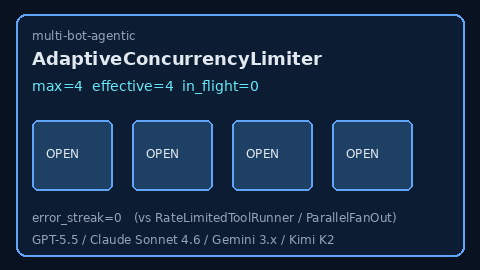

# Adaptive Concurrency Limiter Guide



Global in-flight tool cap with optional adaptive shrink when releases report
errors (and recover on successes).

Works with **GPT-5.5 / Claude Sonnet 4.6 / Gemini 3.x / Kimi K2** agent loops.

Distinct from:

- `RateLimitedToolRunner` — per-tool **sliding time-window** call budget
- `ParallelFanOut` — batch **ThreadPoolExecutor** `max_workers`

## Gap vs AutoGen

| Capability | multi-bot-agentic | AutoGen |
| --- | --- | --- |
| Focus | Global in-flight tool cap + adaptive shrink | Often unbounded tool fanout |
| Failure signal | `release(success=False)` shrinks effective limit | Framework-dependent |
| Wiring | Caller-driven `acquire` / `release` / `snapshot` | Often no built-in adaptive cap |

## Usage

```python
from multi_bot_agentic.concurrency_limiter import AdaptiveConcurrencyLimiter

limiter = AdaptiveConcurrencyLimiter(4, min_in_flight=1, adaptive=True)
assert limiter.acquire(blocking=False)
# ... execute tool ...
limiter.release(success=True)  # or success=False on tool failure
print(limiter.snapshot())  # in_flight, effective_limit, error_streak
```
