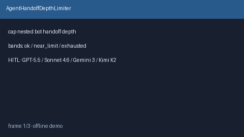

# AgentHandoffDepthLimiter Guide



Offline HITL limiter. Caps chained bot-to-bot handoff depth per session. Never
performs network I/O. Closes unbounded nested-handoff gaps vs AutoGen / CrewAI /
LangGraph.

Optional later polish via **GPT-5.5 / Claude Sonnet 4.6 / Gemini 3.x / Kimi K2**.

Distinct from `BotHandoffReceiptStore` and `BotSpawnBudgetLimiter`.

## Usage

```python
from multi_bot_agentic.agent_handoff_depth import AgentHandoffDepthLimiter

status = AgentHandoffDepthLimiter().check(
    "session-1",
    handoff_depth=2,
    max_depth=4,
)
assert status.requires_human_review is True
print(status.band, status.remaining)
```

## Safety

Always `requires_human_review=True`. No HTTP. Humans decide. See `SAFETY.md`.
