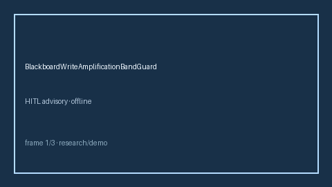

# BlackboardWriteAmplificationBandGuard Guide



Closes AutoGen / CrewAI / LangGraph blackboard write-amplification bands gaps.

Optional later polish via **GPT-5.5 / Claude Sonnet 4.6 / Gemini 3.x / Kimi K2**.

Distinct from `SharedBlackboardWriteLease` and `SharedMemoryConflictBandGuard`.

## Usage

```python
from multi_bot_agentic.blackboard_write_amplification import BlackboardWriteAmplificationBandGuard

status = BlackboardWriteAmplificationBandGuard().check("session-1", write_count=4, read_count=2)
assert status.requires_human_review is True
print(status.band, status.amplification)
```

## Safety

Always `requires_human_review=True`. No HTTP. Humans decide.
