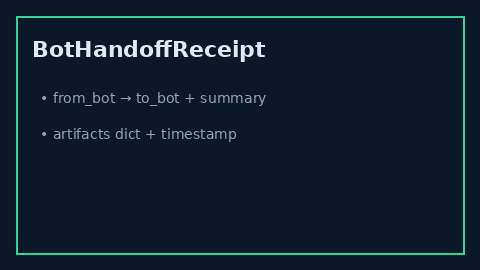

# Bot Handoff Receipt Guide



Structured bot-to-bot handoff receipts for audit trails — `from_bot`, `to_bot`,
`summary`, `artifacts`, and `timestamp_iso` — with an in-memory store and no
network I/O.

Works with **GPT-5.5 / Claude Sonnet 4.6 / Gemini 3.x / Kimi K2** multi-bot loops.

Distinct from the runner `HANDOFF:bot_id:summary` directive (`BOT_HANDOFF_GUIDE.md`)
— this module records receipts for post-hoc audit, it does not swap the active bot.

## Gap vs AutoGen / CrewAI

| Capability | multi-bot-agentic | AutoGen / CrewAI |
| --- | --- | --- |
| Focus | Structured handoff receipts + list_for | Often ephemeral / chat-only handoffs |
| Artifacts | Opaque dict copied at issue time | Framework-dependent |
| Wiring | Caller-driven `issue` / `list_for` | Often no durable receipt store |

## Usage

```python
from multi_bot_agentic.bot_handoff_receipt import BotHandoffReceiptStore

store = BotHandoffReceiptStore()
receipt = store.issue(
    from_bot="researcher",
    to_bot="writer",
    summary="outline ready",
    artifacts={"notes": 3},
)
assert store.list_for("writer")[0].receipt_id == receipt.receipt_id
```
