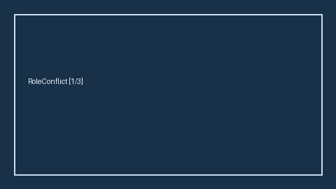

# BotRoleConflictDetector Guide

Detect exclusive role-tag collisions across bots in a session (advisory/hard;
never network I/O).

Works with **GPT-5.5 / Claude Sonnet 4.6 / Gemini 3.x / Kimi K2**.

## Gap vs AutoGen / CrewAI / LangGraph / Semantic Kernel

| Capability | multi-bot-agentic | Popular frameworks |
| --- | --- | --- |
| Focus | BotRoleConflictDetector | Often missing or proprietary |

## Usage

See unit tests under `tests/` for caller-driven examples. Never performs network I/O.
