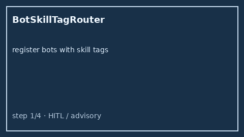

# Bot Skill Tag Router Guide



Register bots with skill tags, then **route** a task string to the best
`bot_id` by tag overlap. Returns ranked matches and a winner (or none).

Works with **GPT-5.5 / Claude Sonnet 4.6 / Gemini 3.x / Kimi K2** multi-bot chats.

Distinct from:

- `StickyBotAffinityStore` — session→bot sticky pins (no skill ranking)
- `BotVoteConsensusAggregator` — majority/plurality over answers (post-hoc)

## Gap vs AutoGen / CrewAI / LangGraph / Semantic Kernel

| Capability | multi-bot-agentic | AutoGen / CrewAI / LangGraph / Semantic Kernel |
| --- | --- | --- |
| Focus | Skill-tag overlap ranked routing | Often hand-wired roles / sticky agents |
| API | `register` / `route` / `unregister` | Framework-dependent selectors |
| Wiring | Caller-driven, no network | Often LLM-chosen speaker |

## Usage

```python
from multi_bot_agentic.bot_skill_router import BotSkillTagRouter

router = BotSkillTagRouter()
router.register("research", ["research", "docs", "search"])
router.register("code", ["code", "python", "refactor"])
result = router.route("research docs for the auth API")
assert result.winner_bot_id == "research"
assert result.matches[0].score >= 1
```
