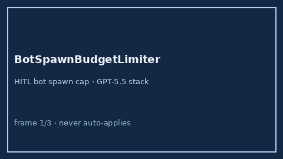

# BotSpawnBudgetLimiter Guide



Offline HITL limiter. Caps dynamic bot spawns per session. Never performs
network I/O. Closes unbounded agent-spawn gaps vs AutoGen / CrewAI / LangGraph.

Optional later polish via **GPT-5.5 / Claude Sonnet 4.6 / Gemini 3.x / Kimi K2**.

Distinct from `BotIdleTimeoutEvictor` and `ConversationTurnBudgetGuard`.

## Usage

```python
from multi_bot_agentic.bot_spawn_budget import BotSpawnBudgetLimiter

status = BotSpawnBudgetLimiter().check(
    "session-1",
    bots_spawned=3,
    max_bots=8,
)
assert status.requires_human_review is True
print(status.band, status.remaining)
```

## Safety

Always `requires_human_review=True`. No HTTP. Humans decide. See `SAFETY.md`.
