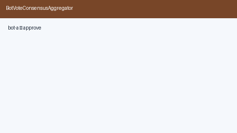

# Bot Vote Consensus Aggregator Guide



Majority or plurality **vote** across bot answers for HITL-style multi-bot
consensus. Record each bot's answer, then `aggregate` for a winner and tally.

Works with **GPT-5.5 / Claude Sonnet 4.6 / Gemini 3.x / Kimi K2** multi-bot crews.

Distinct from:

- `CriticBotVerdictGate` — accept/revise/reject on one producer output
- `ParallelFanOut` — order-preserving parallel task execution / merge

## Gap vs AutoGen / CrewAI / LangGraph

| Capability | multi-bot-agentic | AutoGen / CrewAI / LangGraph |
| --- | --- | --- |
| Focus | Majority/plurality consensus tally | Often critic or merge-only |
| API | `add_vote` / `aggregate` / `clear` | Framework-dependent |
| Wiring | Caller-driven, no network | Often crew/graph runtime |

## Usage

```python
from multi_bot_agentic.bot_vote import BotVoteConsensusAggregator

agg = BotVoteConsensusAggregator(mode="majority")
agg.add_vote(bot_id="researcher", answer="approve")
agg.add_vote(bot_id="critic", answer="approve")
agg.add_vote(bot_id="ops", answer="reject")
result = agg.aggregate()
assert result.winner == "approve"
agg.clear()
```
