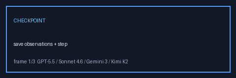

# Checkpoint Resume Guide



Durable Observe→Decide→Act checkpoints for GPT-5.5 / Claude Sonnet 4.6 / Gemini 3.x / Kimi K2 runs.

## Why

Long agent runs can stop mid-loop (budget, process kill, operator cancel). Without a checkpoint, restarting means replaying every tool/LLM call from step 0.

## What This Adds

- `EventType.CHECKPOINT` events in the existing sqlite event log
- `save_checkpoint(...)` / `load_latest_checkpoint(run_id)`
- `AgentRunner.resume(run_id)` plus CLI `resume`

## Gap vs LangGraph Checkpointers

LangGraph ships thread-scoped checkpointers (MemorySaver, SqliteSaver, PostgresSaver) with graph-node cursors and channel values. This module is intentionally thinner:

| Capability | multi-bot-agentic | LangGraph |
| --- | --- | --- |
| Storage | Reuses event log rows | Dedicated checkpoint store |
| Granularity | Per-step observation snapshot | Per-node channel snapshot |
| API | `resume(run_id)` | `graph.invoke(..., thread_id=...)` |
| Dependencies | stdlib sqlite only | LangGraph checkpoint packages |

## Usage

```bash
multi-bot-agentic run --goal "Draft a launch plan" --provider fake --run-id run-1 --event-log /tmp/runs.sqlite
multi-bot-agentic resume --run-id run-1 --event-log /tmp/runs.sqlite --provider fake
```

Library API:

```python
from multi_bot_agentic.checkpoint import load_latest_checkpoint, save_checkpoint
from multi_bot_agentic.runner import AgentRunner

snapshot = load_latest_checkpoint(event_log, "run-1")
result = runner.resume("run-1")
```

## Safety

- Checkpoints store observation text already accepted by the runner; they do not grant new tools.
- Resume still enforces `SafetyPolicy` step budgets, tool allowlists, and cancellation files.
- Only the latest checkpoint for a `run_id` is loaded.
