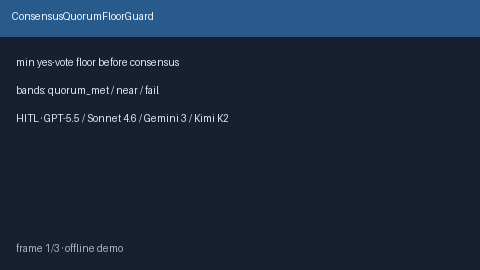

# ConsensusQuorumFloorGuard Guide



Offline HITL guard. Requires a minimum yes-vote count before consensus. Never
performs network I/O. Closes thin-quorum gaps vs AutoGen / CrewAI / LangGraph.

Optional later polish via **GPT-5.5 / Claude Sonnet 4.6 / Gemini 3.x / Kimi K2**.

Distinct from `VoteTieBreakPolicy` and `ConsensusConfidenceBandAdvisor`.

## Usage

```python
from multi_bot_agentic.consensus_quorum_floor import ConsensusQuorumFloorGuard

status = ConsensusQuorumFloorGuard().check(
    "session-1",
    yes_votes=2,
    min_yes_votes=3,
)
assert status.requires_human_review is True
print(status.band, status.shortfall)
```

## Safety

Always `requires_human_review=True`. No HTTP. Humans decide. See `SAFETY.md`.
