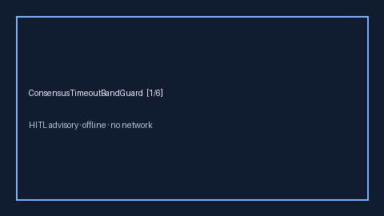

# ConsensusTimeoutBandGuard Guide



Offline HITL guard. Flags consensus waits vs timeout budget.
Closes AutoGen / CrewAI / LangGraph consensus-timeout gaps.

Optional polish via **GPT-5.5 / Claude Sonnet 4.6 / Gemini 3.x / Kimi K2**.

Distinct from `ConsensusQuorumFloorGuard` and `OrchestratorStallWatchdog`.

## Usage

```python
from multi_bot_agentic.consensus_timeout_band import ConsensusTimeoutBandGuard

status = ConsensusTimeoutBandGuard().check("s1", waited_s=8.0, timeout_s=10.0)
assert status.requires_human_review is True
print(status.band, status.ratio)
```

## Safety

Always `requires_human_review=True`. No HTTP. Humans decide.
