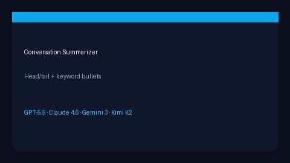

# Conversation Summarizer Guide



Extractive rolling summary for long multi-bot transcripts. Keeps head/tail
messages verbatim and compresses the middle into keyword bullets — no LLM call
required for v1.

Optional later abstractive polish via **GPT-5.5 / Claude Sonnet 4.6 / Gemini 3.x / Kimi K2**.

## Gap vs CrewAI / AutoGen / LangChain

| Capability | multi-bot-agentic | CrewAI / AutoGen / LangChain |
| --- | --- | --- |
| Method | Extractive head/tail + keywords | Often LLM summary memory |
| Dependencies | Stdlib only | Framework memory backends |
| Bounds | Hard `max_summary_chars` | Framework-specific |

## Usage

```python
from multi_bot_agentic.summarizer import ConversationSummarizer

summary = ConversationSummarizer(keep_head=2, keep_tail=2).summarize(
    [
        "Goal: ship checklist",
        "Observe requirements",
        "Discuss FastAPI Redis",
        "Final: ship MVP",
    ]
)
print(summary.summary_text)
print(summary.keywords)
```
