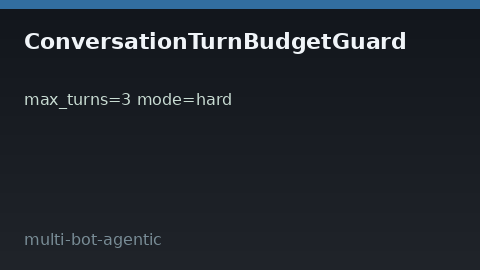

# Conversation Turn Budget Guard Guide



Cap turns per `session_id` with **advisory** (status only) or **hard**
(raises when exhausted) modes. Record after each exchange; check before the
next turn.

Works with **GPT-5.5 / Claude Sonnet 4.6 / Gemini 3.x / Kimi K2** multi-bot chats.

Distinct from:

- `BudgetedStepPlanner` — token/step preflight before LLM calls
- `RunDeadlineWatchdog` — wall-clock remaining/expired advisory

## Gap vs AutoGen / CrewAI / LangGraph

| Capability | multi-bot-agentic | AutoGen / CrewAI / LangGraph |
| --- | --- | --- |
| Focus | Per-session turn budget + advisory/hard | Often step/token only |
| API | `record_turn` / `check` / `reset` | Framework-dependent |
| Wiring | Caller-driven, no network | Often graph recursion limits |

## Usage

```python
from multi_bot_agentic.turn_budget import ConversationTurnBudgetGuard

guard = ConversationTurnBudgetGuard(max_turns=3, mode="hard")
guard.record_turn("sess-1")
status = guard.check("sess-1")
assert status.remaining == 2
guard.reset("sess-1")
```
