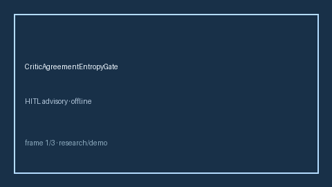

# CriticAgreementEntropyGate Guide



Closes AutoGen / CrewAI / LangGraph critic agreement-entropy gates gaps.

Optional later polish via **GPT-5.5 / Claude Sonnet 4.6 / Gemini 3.x / Kimi K2**.

Distinct from `CriticVerdictDiversityGate` and `CriticTimeoutBandGuard`.

## Usage

```python
from multi_bot_agentic.critic_agreement_entropy import CriticAgreementEntropyGate

status = CriticAgreementEntropyGate().check("session-1", verdicts=["approve", "revise", "approve"])
assert status.requires_human_review is True
print(status.band, status.entropy)
```

## Safety

Always `requires_human_review=True`. No HTTP. Humans decide.
