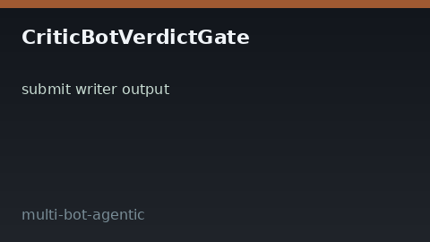

# Critic Bot Verdict Gate Guide



Critic-pattern gate for agent outputs: producer `submit`s text, critic
`decide`s **accept** / **revise** / **reject** with optional critique and
revision hints.

Works with **GPT-5.5 / Claude Sonnet 4.6 / Gemini 3.x / Kimi K2** multi-bot crews.

Distinct from:

- `HitlApprovalGate` — human file-backed approvals for sensitive **tools**

This module is an in-memory **critic verdict** store for producer outputs.

## Gap vs AutoGen / CrewAI / LangGraph

| Capability | multi-bot-agentic | AutoGen / CrewAI / LangGraph |
| --- | --- | --- |
| Focus | Accept/revise/reject verdict gate | Often ad-hoc critic prompts |
| API | `submit` / `decide` / `list_pending` | Framework-dependent |
| Wiring | Caller-driven, no network | Often nested agent chats only |

## Usage

```python
from multi_bot_agentic.critic_verdict import CriticBotVerdictGate, CriticVerdict

gate = CriticBotVerdictGate()
review = gate.submit(bot_id="writer", output_text="Draft answer")
gate.decide(
    review.review_id,
    verdict=CriticVerdict.REVISE,
    critique="too vague",
    revision_hint="add citations",
)
assert gate.get(review.review_id).verdict is CriticVerdict.REVISE
```
