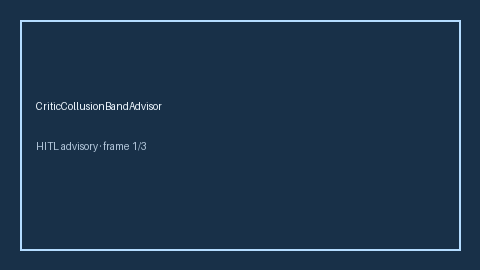

# CriticCollusionBandAdvisor Guide



Offline HITL advisor. Never network I/O.
Gap vs AutoGen/CrewAI/LangGraph critic-collusion band advisors. Distinct from `CriticAgreementEntropyAdvisor` / `CriticVerdictDiversityAdvisor`.

Optional polish via **GPT-5.5 / Claude Sonnet 4.6 / Gemini 3.x / Kimi K2**.

## Usage

```python
from multi_bot_agentic.critic_collusion_band import CriticCollusionBandAdvisor

status = CriticCollusionBandAdvisor().check("s1", collusion_score=0.35)
assert status.requires_human_review is True
print(status.band)
```

## Safety

Always HITL. Humans decide.
