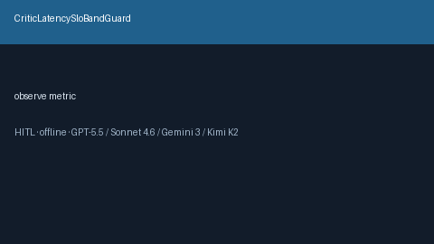

# CriticLatencySloBandGuard Guide



Offline HITL guard/advisor. Never auto-acts. Closes closed-UI gaps vs AutoGen/CrewAI/LangGraph critic latency SLO controls.

Optional later polish via **GPT-5.5 / Claude Sonnet 4.6 / Gemini 3.x / Kimi K2**.

Distinct from `CriticTimeoutBandGuard and CriticPassBudgetLimiter`.

## Usage

```python
from multi_bot_agentic.critic_latency_slo import CriticLatencySloBandGuard

status = CriticLatencySloBandGuard().check("session-1", latency_ms=2250.0)
assert status.requires_human_review is True
print(status.band)
```

## Safety

Always `requires_human_review=True`. No HTTP. Humans decide. See `docs/SAFETY.md`.
