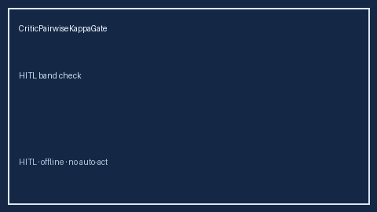

# CriticPairwiseKappaGate Guide



Closes AutoGen/CrewAI/LangGraph critic pairwise Cohen-kappa agreement controls gaps.

Optional later polish via **GPT-5.5 / Claude Sonnet 4.6 / Gemini 3.x / Kimi K2**.

Distinct from `CriticAgreementEntropyGate` and `CriticVerdictDiversityGate`.

## Usage

```python
from multi_bot_agentic.critic_pairwise_kappa import CriticPairwiseKappaGate

status = CriticPairwiseKappaGate().check("session-1", kappa=0.45)
assert status.requires_human_review is True
print(status.band)
```

## Safety

Always `requires_human_review=True`. No HTTP. Humans decide.
