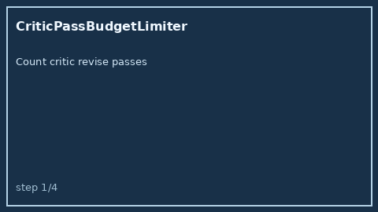

# CriticPassBudgetLimiter Guide



Offline HITL critic re-pass budget. Never performs network I/O.

Optional polish via **GPT-5.5 / Claude Sonnet 4.6 / Gemini 3.x / Kimi K2**.

Distinct from `CriticBotVerdictGate` and `DebateRoundLimiter`.

## Usage

```python
from multi_bot_agentic.critic_pass_budget import CriticPassBudgetLimiter

status = CriticPassBudgetLimiter().check("sess-1", passes_used=2, max_passes=3)
assert status.requires_human_review is True
print(status.band, status.remaining)
```
