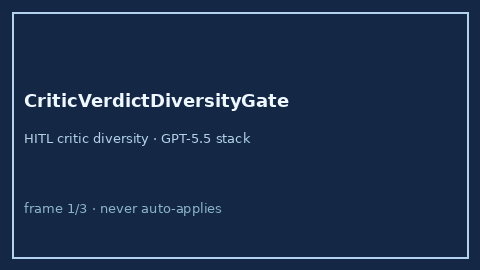

# CriticVerdictDiversityGate Guide



Offline HITL gate. Flags echo-chamber critic verdicts. Never performs network
I/O. Closes critic-diversity gaps vs AutoGen / CrewAI / LangGraph.

Optional later polish via **GPT-5.5 / Claude Sonnet 4.6 / Gemini 3.x / Kimi K2**.

Distinct from `CriticPassBudgetLimiter` and `CriticBotVerdictGate`.

## Usage

```python
from multi_bot_agentic.critic_verdict_diversity import CriticVerdictDiversityGate

status = CriticVerdictDiversityGate().check(
    "session-1",
    ["accept", "revise", "accept"],
)
assert status.requires_human_review is True
print(status.band, status.diversity_ratio)
```

## Safety

Always `requires_human_review=True`. No HTTP. Humans decide. See `SAFETY.md`.
