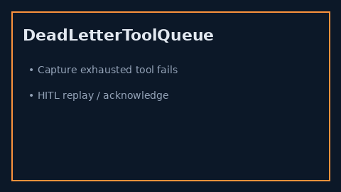

# Dead Letter Tool Queue Guide



Capture permanently failed tool calls for HITL replay after retries and circuit
breakers are exhausted.

Works with **GPT-5.5 / Claude Sonnet 4.6 / Gemini 3.x / Kimi K2** tool loops.

Distinct from:

- `ToolRetryBackoffPolicy` — transient **retries** with jittered backoff
- `ToolCircuitBreaker` — **fail-fast** open/half-open isolation

This module is a **post-exhaustion** dead-letter queue for operator review.

## Gap vs AutoGen / CrewAI / LangGraph

| Capability | multi-bot-agentic | AutoGen / CrewAI / LangGraph |
| --- | --- | --- |
| Focus | HITL dead-letter after exhaustion | Often drop failed tool payloads |
| API | `enqueue` / `list_pending` / `acknowledge` | Framework-dependent |
| Wiring | Caller-driven, no network | Often no durable DLQ |

## Usage

```python
from multi_bot_agentic.dead_letter_tool_queue import DeadLetterToolQueue

queue = DeadLetterToolQueue()
item = queue.enqueue("search", {"q": "docs"}, "timeout after retries", 3)
assert queue.list_pending()[0].item_id == item.item_id
queue.acknowledge(item.item_id)
assert queue.list_pending() == []
```
