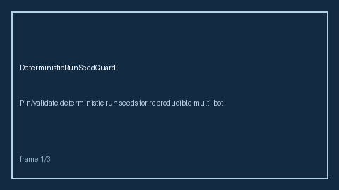

# DeterministicRunSeedGuard Guide



Pin/validate deterministic run seeds for reproducible multi-bot runs. Never performs network I/O. Optional polish via **GPT-5.5 / Claude Sonnet 4.6 / Gemini 3.x / Kimi K2**.

## Usage

```python
from multi_bot_agentic.deterministic_run_seed import DeterministicRunSeedGuard
# see unit tests for examples
```
