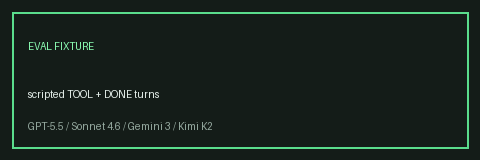

# Offline Evaluation Harness Guide



Golden-path scoring for GPT-5.5 / Claude Sonnet 4.6 / Gemini 3.x / Kimi K2 agent loops.

## Why

Regressions in tool routing or DONE answers are hard to catch without replaying
a fixed Fake-LLM script. Hosted eval products add network and account overhead.

## What This Adds

- `multi_bot_agentic.eval.EvaluationHarness`
- JSON fixtures under `src/multi_bot_agentic/eval/fixtures/`
- Metrics: tool-sequence score + DONE answer score
- CLI: `multi-bot-agentic eval`

## Gap vs LangSmith / CrewAI Evals

| Capability | multi-bot-agentic | LangSmith / CrewAI |
| --- | --- | --- |
| Runtime | Offline Fake/scripted LLM | Hosted traces + datasets |
| Graders | Deterministic tool/DONE scores | LLM-as-judge, custom evaluators |
| UI | CLI JSON report | Web datasets / experiment UI |
| Dependencies | stdlib + local sqlite | Cloud project credentials |

## Usage

```bash
multi-bot-agentic eval
multi-bot-agentic eval --fixtures src/multi_bot_agentic/eval/fixtures
```

```python
from pathlib import Path
from multi_bot_agentic.eval import EvaluationHarness, default_fixture_dir, load_scenarios

report = EvaluationHarness(load_scenarios(default_fixture_dir())).run(
    root=Path.cwd(),
    event_log_dir=Path("data/eval-logs"),
)
assert report.pass_rate == 1.0
```

## Fixture Schema

```json
{
  "scenario_id": "checklist_happy_path",
  "goal": "Create an agent launch checklist",
  "scripted_responses": ["TOOL:checklist:...", "DONE: launch checklist ready"],
  "expected_tools": ["checklist"],
  "expected_answer": "launch checklist ready",
  "max_steps": 5
}
```

## Safety

Fixtures execute only allowlisted tools under `SafetyPolicy`. Scripted responses
cannot expand the tool allowlist or bypass step budgets.
