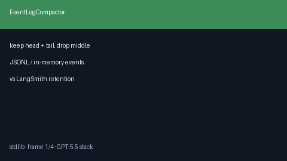

# Event Log Compactor Guide



Bounded compaction for long multi-bot event streams: keep head + tail, drop
the middle, insert an `event_log.compacted` marker.

Works with **GPT-5.5 / Claude Sonnet 4.6 / Gemini 3.x / Kimi K2** ODA runs.

## Gap vs LangSmith / Langfuse

| Capability | multi-bot-agentic | LangSmith / Langfuse |
| --- | --- | --- |
| Scope | Offline list/JSONL compact | Hosted retention policies |
| Marker | Explicit compacted event | Vendor-specific |
| Wiring | Stdlib-only helper | SaaS dashboards |

## Usage

```python
from multi_bot_agentic.event_compactor import EventLogCompactor

result = EventLogCompactor(keep_head=50, keep_tail=50).compact(events)
print(result.dropped_count)
```
