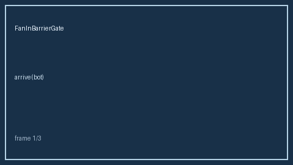

# FanInBarrierGate Guide



Fan-in barrier that releases after N distinct bot arrivals (advisory/hard).
Fills an AutoGen / CrewAI / LangGraph fan-in barrier gap. Works with **GPT-5.5 /
Claude Sonnet 4.6 / Gemini 3.x / Kimi K2**. Never performs network I/O.

Distinct from `BotVoteConsensusAggregator` and `PlanStepDependencyResolver`.

## Usage

```python
from multi_bot_agentic.fanin_barrier import FanInBarrierGate

gate = FanInBarrierGate(required=2, mode="hard")
gate.arrive("join", "bot-a")
print(gate.arrive("join", "bot-b").released)  # True
```
