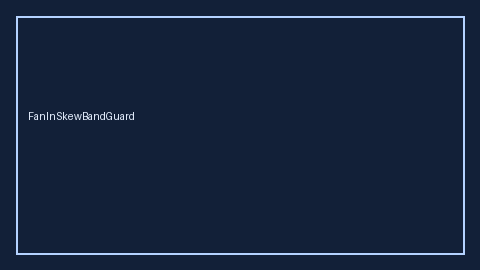

# FanInSkewBandGuard Guide



Closes AutoGen / CrewAI / LangGraph fan-in latency skew gaps.

Optional later polish via **GPT-5.5 / Claude Sonnet 4.6 / Gemini 3.x / Kimi K2**.

Distinct from `FanInBarrierGate` and `ToolCallWaveScheduler`.

## Usage

```python
from multi_bot_agentic.fan_in_skew_band import FanInSkewBandGuard

status = FanInSkewBandGuard().check("session-1", fastest_s=1.0, slowest_s=2.0)
assert status.requires_human_review is True
print(status.band)
```

## Safety

Always `requires_human_review=True`. No HTTP. Humans decide.
