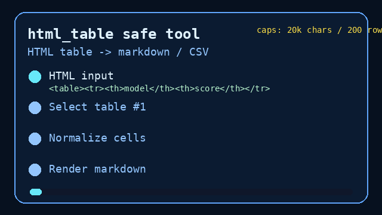

# HTML Table Tool User Guide



## Why

Agents routinely receive useful tabular data wrapped in HTML: release notes,
documentation pages, email digests, dashboards, and search-result snippets. Letting
a model transcribe those tables can shift cells, miss HTML entities, or overrun
the event log. **multi-bot-agentic** includes `html_table` as a deterministic,
allowlisted extractor that is safe for GPT-5.5 / Claude Sonnet 4.6 / Gemini 3.x /
Kimi K2 workers.

## Usage

Programmatic:

```python
from multi_bot_agentic.models import ToolInvocation
from multi_bot_agentic.tools.html_table import HtmlTableTool

result = HtmlTableTool().execute(
    ToolInvocation(
        tool_name="html_table",
        arguments={
            "text": "<table><tr><th>model</th><th>score</th></tr><tr><td>GPT-5.5</td><td>98</td></tr></table>",
            "format": "markdown",
        },
    )
)
print(result.content)
```

Via the decision-engine directive, the first table is extracted as markdown:

```text
TOOL:html_table:<table><tr><th>model</th><th>score</th></tr><tr><td>Kimi K2</td><td>94</td></tr></table>
```

Use the single-payload option sentinel when a directive needs a later table or
CSV output:

```text
TOOL:html_table:<table><tr><td>skip</td></tr></table><table><tr><th>model</th></tr><tr><td>Gemini 3.x</td></tr></table>
<<<HTML_TABLE>>>index=2;format=csv
```

## Bounds

| Limit | Value |
|---|---|
| Max document chars | 20_000 |
| Max output chars | 20_000 |
| Max rows | 200 |
| Max columns | 32 |
| Table index | 1-based |
| Formats | `markdown`, `csv` |
| Rejected tags | `script`, `style` |

Empty input, missing tables, out-of-bounds indexes, oversized documents, too many
rows/columns, unsupported formats, and documents containing `<script>` or
`<style>` return `ok=False` structured failures. Cell text is entity-decoded,
trimmed, and normalized; markdown output escapes pipes and renders cell newlines
as `<br>`.

## Safety

Listed in `SafetyPolicy.allowed_tools` as `html_table`. No network, no code
execution, no BeautifulSoup dependency -- stdlib `html.parser` and `csv` only.
See `docs/SAFETY.md`.
