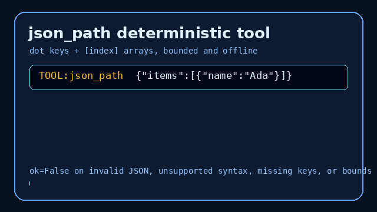

# JSON Flatten Tool User Guide



## Why

Agents often need nested JSON observations reduced to a flat key/value map before
the next model turn. **multi-bot-agentic** includes `json_flatten` as a
deterministic, allowlisted stdlib `json` helper that is safe for GPT-5.5 /
Claude Sonnet 4.6 / Gemini 3.x / Kimi K2 workers.

Unlike `json_path`, which extracts one value, `json_flatten` emits the whole
flattened map with dotted/bracket keys such as `a.b[0].c`.

## Usage

Programmatic arguments:

```python
from multi_bot_agentic.models import ToolInvocation
from multi_bot_agentic.tools.json_flatten import JsonFlattenTool

result = JsonFlattenTool().execute(
    ToolInvocation(
        tool_name="json_flatten",
        arguments={
            "text": '{"model":"GPT-5.5","items":[{"name":"Claude Sonnet 4.6"}]}',
            "separator": ".",
        },
    )
)
print(result.content)
```

Via the decision-engine directive:

```text
TOOL:json_flatten:{"model":"GPT-5.5","items":[{"name":"Claude Sonnet 4.6"}]}
```

## Behavior

Nested objects become dotted keys using the requested separator (default `.`).
Array indexes use bracket notation appended directly to the current prefix, for
example `items[0].name`. Scalar root documents flatten to `{}`. Empty, oversized,
malformed, or over-expanded input returns `ok=False`.

Metadata includes `keys`, `separator`, output `chars`, and input `input_chars`.

## Bounds

| Limit | Value |
|---|---|
| Max input/output chars | 20_000 |
| Max flattened keys | 2000 |
| Default separator | `.` |
| Parser | Python stdlib `json` only |
| Network access | none |

## Safety

Listed in `SafetyPolicy.allowed_tools` as `json_flatten`. It uses only stdlib
`json`, with no network or code execution. See `docs/SAFETY.md`.
