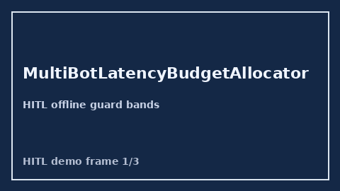

        # MultiBotLatencyBudgetAllocator Guide

        

        Closes AutoGen / CrewAI / LangGraph multi-bot latency budget allocators gaps.

        Optional later polish via **GPT-5.5 / Claude Sonnet 4.6 / Gemini 3.x / Kimi K2**.

        Distinct from `TurnBudgetGuard` and `CriticTimeoutBandGuard`.

        ## Usage

        ```python
        from multi_bot_agentic.multi_bot_latency_budget import (
    MultiBotLatencyBudgetAllocator,
)

status = MultiBotLatencyBudgetAllocator().check(
    "session-1", bot_id="planner", allocated_ms=1000.0, used_ms=900.0
)
assert status.requires_human_review is True
print(status.band, status.utilization)
        ```

        ## Safety

        Always `requires_human_review=True`. No HTTP. Humans decide.
