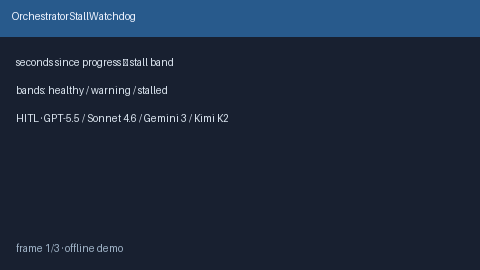

# OrchestratorStallWatchdog Guide



Offline HITL watchdog. Flags stalled orchestrator loops from
seconds-since-progress. Never performs network I/O. Closes stuck-orchestrator
gaps vs AutoGen / CrewAI / LangGraph.

Optional later polish via **GPT-5.5 / Claude Sonnet 4.6 / Gemini 3.x / Kimi K2**.

Distinct from `BotHeartbeatLivenessWatchdog` and `BotIdleTimeoutEvictor`.

## Usage

```python
from multi_bot_agentic.orchestrator_stall_watchdog import OrchestratorStallWatchdog

status = OrchestratorStallWatchdog().check(
    "session-1",
    seconds_since_progress=45.0,
)
assert status.requires_human_review is True
print(status.band)
```

## Safety

Always `requires_human_review=True`. No HTTP. Humans decide. See `SAFETY.md`.
