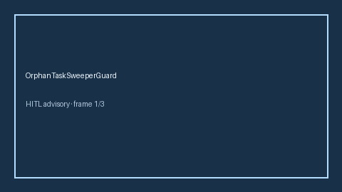

# OrphanTaskSweeperGuard Guide



Offline HITL guard. Never network I/O.
Gap vs AutoGen/CrewAI/LangGraph orphan-task sweepers. Distinct from `DeadLetterToolQueue` / `RunDeadlineWatchdog`.

Optional polish via **GPT-5.5 / Claude Sonnet 4.6 / Gemini 3.x / Kimi K2**.

## Usage

```python
from multi_bot_agentic.orphan_task_sweeper import OrphanTaskSweeperGuard

status = OrphanTaskSweeperGuard().check("s1", orphan_count=0.35)
assert status.requires_human_review is True
print(status.band)
```

## Safety

Always HITL. Humans decide.
