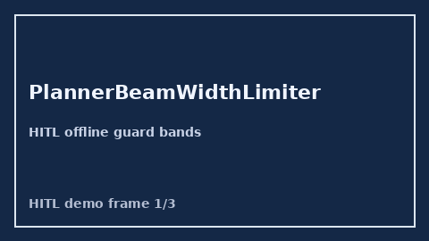

        # PlannerBeamWidthLimiter Guide

        

        Closes AutoGen / CrewAI / LangGraph planner beam-width controls gaps.

        Optional later polish via **GPT-5.5 / Claude Sonnet 4.6 / Gemini 3.x / Kimi K2**.

        Distinct from `DebateRoundLimiter` and `PlannerReplanBudgetLimiter`.

        ## Usage

        ```python
        from multi_bot_agentic.planner_beam_width import PlannerBeamWidthLimiter

status = PlannerBeamWidthLimiter().check("session-1", beam_width=6)
assert status.requires_human_review is True
print(status.band)
        ```

        ## Safety

        Always `requires_human_review=True`. No HTTP. Humans decide.
