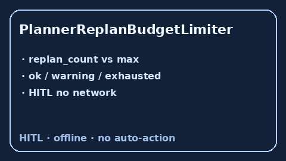

# PlannerReplanBudgetLimiter Guide



Offline HITL limiter. Caps planner replan loops. Closes gaps vs AutoGen /
CrewAI / LangGraph unbounded replanning.

Optional later polish via **GPT-5.5 / Claude Sonnet 4.6 / Gemini 3.x / Kimi K2**.

Distinct from `BudgetedStepPlanner` and `CriticPassBudgetLimiter`.

## Usage

```python
from multi_bot_agentic.planner_replan_budget import PlannerReplanBudgetLimiter

status = PlannerReplanBudgetLimiter().check("s1", replan_count=2, max_replans=3)
assert status.requires_human_review is True
print(status.band)
```

## Safety

Always `requires_human_review=True`. No HTTP. Humans decide. See `SAFETY.md`.
