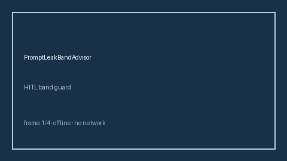

# PromptLeakBandAdvisor Guide



Offline HITL advisor. Never performs network I/O.
Closes gaps vs AutoGen/CrewAI/LangGraph prompt-leak band advisors.

Optional later polish via **GPT-5.5 / Claude Sonnet 4.6 / Gemini 3.x / Kimi K2**.

Distinct from `ArgumentSanitizer` / `ToolResultPoisoningGuard`.

## Usage

```python
from multi_bot_agentic.prompt_leak_band import PromptLeakBandAdvisor

status = PromptLeakBandAdvisor().check("session-1", leak_score=0.35)
assert status.requires_human_review is True
print(status.band)
```

## Safety

Always `requires_human_review=True`. No HTTP. Humans decide.
