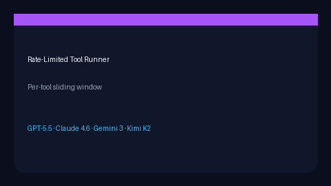

# Rate-Limited Tool Runner Guide



Per-tool sliding-window rate limit around `ToolAdapter.execute`. Distinct from
`SafetyPolicy` step/timeout caps.

Works with **GPT-5.5 / Claude Sonnet 4.6 / Gemini 3.x / Kimi K2** tool loops.

## Gap vs CrewAI / AutoGen

| Capability | multi-bot-agentic | CrewAI / AutoGen |
| --- | --- | --- |
| Scope | Per-tool call budget | Global concurrency knobs |
| Failure | Hard reject + retry_after | Framework-specific |
| Wiring | Caller-driven wrapper | Often framework-integrated |

## Usage

```python
from multi_bot_agentic.tool_runner import RateLimitedToolRunner, RateLimitExceededError
from multi_bot_agentic.models import ToolInvocation

runner = RateLimitedToolRunner(tools_by_name, max_calls=8, window_seconds=60.0)
try:
    result = runner.execute(ToolInvocation(tool_name="checklist", arguments={"text": "ship"}))
except RateLimitExceededError as exc:
    print(exc.details.retry_after_seconds)
```
