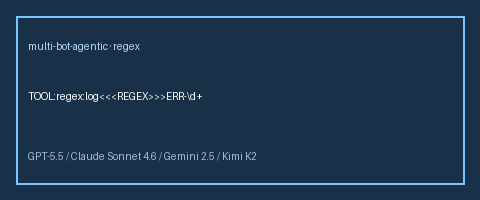

# Regex Extract Tool User Guide



## Why

Popular agent frameworks (LangGraph toolkits, OpenAI Agents SDK examples, Claude
tool-use demos) ship a dedicated **regex/extract** helper so the model does not
hallucinate spans. **multi-bot-agentic** now includes the same capability as a
deterministic, allowlisted tool — safe for GPT-5.5 / Claude Sonnet 4.6 /
Gemini 2.5 / Kimi K2 workers.

## Usage

Programmatic (two arguments):

```python
from multi_bot_agentic.models import ToolInvocation
from multi_bot_agentic.tools.regex_extract import RegexExtractTool

result = RegexExtractTool().execute(
    ToolInvocation(
        tool_name="regex",
        arguments={"text": "ticket ABC-42 done", "pattern": r"([A-Z]+)-(\d+)"},
    )
)
print(result.content)
```

Via the decision-engine directive (single payload + sentinel):

```text
TOOL:regex:ticket ABC-42 done<<<REGEX>>>([A-Z]+)-(\d+)
```

## Bounds

| Limit | Value |
|---|---|
| Max document chars | 20_000 |
| Max pattern chars | 512 |
| Max matches | 100 |

Empty sides, oversized input, ambiguous sentinels, invalid patterns, and match
overflow return `ok=False` structured failures — never exceptions into the run loop.

## Diff sentinel note

The companion `diff` tool now accepts a bare `<<<DIFF>>>` marker (with or without
surrounding newlines), so single-line payloads like `before<<<DIFF>>>after` work.

## Safety

Listed in `SafetyPolicy.allowed_tools` as `regex`. No network, no code execution,
stdlib `re` only. See `docs/SAFETY.md`.
