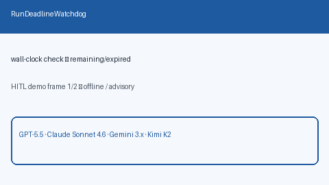

# Run Deadline Watchdog Guide



Advisory wall-clock deadline for agent runs: poll `check(now)` for
remaining/expired status. Never kills processes itself.

Works with **GPT-5.5 / Claude Sonnet 4.6 / Gemini 3.x / Kimi K2** agent loops.

Distinct from:

- `ToolCircuitBreaker` — per-tool **failure** isolation
- `AdaptiveConcurrencyLimiter` — global **in-flight** caps

This module is a **wall-clock advisory** signal for run budgets.

## Gap vs AutoGen / CrewAI / LangGraph

| Capability | multi-bot-agentic | AutoGen / CrewAI / LangGraph |
| --- | --- | --- |
| Focus | Explicit wall-clock deadline status | Often step-count only |
| API | `check(now)` → remaining / expired | Framework-dependent |
| Wiring | Caller-driven, advisory only | Often process-killing timers |

## Usage

```python
from datetime import datetime, timedelta, timezone
from multi_bot_agentic.run_deadline import RunDeadlineWatchdog

deadline = datetime.now(timezone.utc) + timedelta(seconds=30)
watchdog = RunDeadlineWatchdog(deadline_at=deadline)
status = watchdog.check()
assert status.expired is False
assert status.remaining_seconds > 0
```
