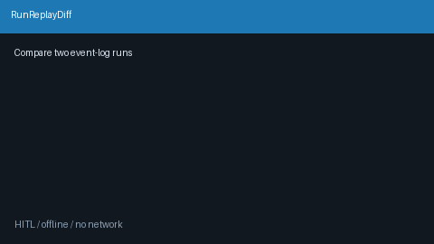

# Run Replay Diff Guide



Compare two event-log run sequences for drift on `event_type` / `state` /
normalized `payload`, while ignoring timestamp fields.

Works with **GPT-5.5 / Claude Sonnet 4.6 / Gemini 3.x / Kimi K2** ODA runs.

Distinct from `EventLogCompactor` (head/tail size compaction) — this module
detects **run-to-run behavioral drift**, not log size.

## Gap vs AutoGen / CrewAI

| Capability | multi-bot-agentic | AutoGen / CrewAI |
| --- | --- | --- |
| Focus | Positional event-log drift diff | Often no built-in run-to-run diff |
| Compared fields | event_type, state, payload (−timestamps) | Framework-dependent traces |
| Wiring | Caller-driven `diff(left, right)` | Replay UIs / custom scripts |

## Usage

```python
from multi_bot_agentic.run_replay_diff import RunReplayDiff

left = [
    {
        "event_type": "decision",
        "state": "decide",
        "timestamp": "2026-01-01T00:00:00Z",
        "payload": {"tool": "echo", "created_at": "t1"},
    }
]
right = [
    {
        "event_type": "decision",
        "state": "decide",
        "timestamp": "2026-09-11T12:00:00Z",
        "payload": {"tool": "echo", "created_at": "t2"},
    }
]
result = RunReplayDiff().diff(left, right)
assert result.equal
print(result.changed_indices, result.added_indices, result.removed_indices)
```
