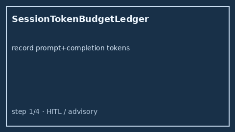

# Session Token Budget Ledger Guide



Track cumulative prompt + completion tokens per `session_id` with **soft** and
**hard** thresholds. Status is `ok` / `soft` / `hard` — the ledger never kills
processes or performs network I/O.

Works with **GPT-5.5 / Claude Sonnet 4.6 / Gemini 3.x / Kimi K2** multi-bot chats.

Distinct from:

- `ConversationTurnBudgetGuard` — max turns per session (count-based)
- `RunDeadlineWatchdog` — wall-clock remaining/expired advisory
- `BudgetedStepPlanner` — step/token preflight before a run (not cumulative)

## Gap vs AutoGen / CrewAI / LangGraph / Semantic Kernel

| Capability | multi-bot-agentic | AutoGen / CrewAI / LangGraph / Semantic Kernel |
| --- | --- | --- |
| Focus | Per-session cumulative soft/hard token ledger | Often step/token per call or graph only |
| API | `record` / `check` / `reset` | Framework-dependent |
| Wiring | Caller-driven, advisory status, no kill | Often hard recursion / context caps |

## Usage

```python
from multi_bot_agentic.session_token_budget import SessionTokenBudgetLedger

ledger = SessionTokenBudgetLedger(soft_limit=1000, hard_limit=2000)
status = ledger.record("sess-1", prompt_tokens=400, completion_tokens=100)
assert status.status == "ok"
assert status.remaining_to_hard == 1500
ledger.reset("sess-1")
```
