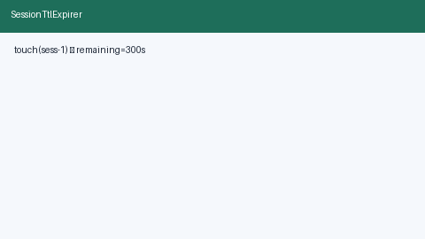

# Session TTL Expirer Guide



Idle **TTL** per `session_id` with **advisory** (status only) or **hard**
(raises when expired) modes. Call `touch` on activity to reset the deadline;
`check` before continuing a session.

Works with **GPT-5.5 / Claude Sonnet 4.6 / Gemini 3.x / Kimi K2** multi-bot chats.

Distinct from:

- `ConversationTurnBudgetGuard` — max turns per session (count-based)
- `RunDeadlineWatchdog` — single wall-clock deadline for one agent run

## Gap vs AutoGen / CrewAI / LangGraph

| Capability | multi-bot-agentic | AutoGen / CrewAI / LangGraph |
| --- | --- | --- |
| Focus | Per-session idle TTL + advisory/hard | Often step/token only |
| API | `touch` / `check` / `reset` | Framework-dependent |
| Wiring | Caller-driven, activity resets TTL | Often graph recursion limits |

## Usage

```python
from datetime import datetime, timezone
from multi_bot_agentic.session_ttl import SessionTtlExpirer

expirer = SessionTtlExpirer(ttl_seconds=300.0, mode="hard")
now = datetime.now(timezone.utc)
expirer.touch("sess-1", now=now)
status = expirer.check("sess-1", now=now)
assert status.expired is False
expirer.reset("sess-1")
```
