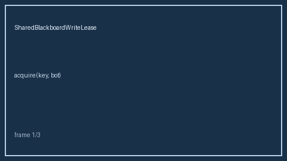

# SharedBlackboardWriteLease Guide



Exclusive time-bounded write leases for blackboard keys (advisory/hard). Fills an
AutoGen / CrewAI / LangGraph shared-memory lease gap. Works with **GPT-5.5 /
Claude Sonnet 4.6 / Gemini 3.x / Kimi K2**. Never performs network I/O.

Distinct from `BlackboardEntryTtlEvictor`.

## Usage

```python
from multi_bot_agentic.blackboard_write_lease import SharedBlackboardWriteLease

lease = SharedBlackboardWriteLease(lease_seconds=30.0, mode="hard")
print(lease.acquire("plan", "bot-a").acquired)
print(lease.acquire("plan", "bot-b").allowed)  # False in hard mode
```
