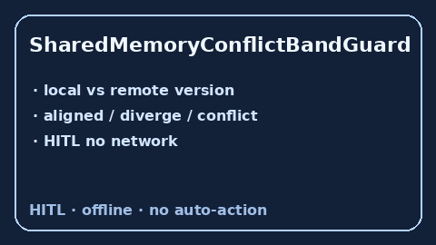

# SharedMemoryConflictBandGuard Guide



Offline HITL guard. Surfaces shared-memory version-skew conflicts. Closes
gaps vs AutoGen / CrewAI / LangGraph CRDT conflict bands.

Optional later polish via **GPT-5.5 / Claude Sonnet 4.6 / Gemini 3.x / Kimi K2**.

Distinct from `SharedMemoryQuotaGuard` and `SharedBlackboardWriteLease`.

## Usage

```python
from multi_bot_agentic.shared_memory_conflict_band import SharedMemoryConflictBandGuard

status = SharedMemoryConflictBandGuard().check(
    "s1", key="plan", local_version=1, remote_version=4
)
assert status.requires_human_review is True
print(status.band, status.version_skew)
```

## Safety

Always `requires_human_review=True`. No HTTP. Humans decide. See `SAFETY.md`.
