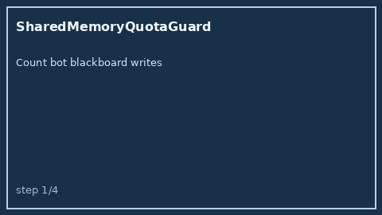

# SharedMemoryQuotaGuard Guide



Offline HITL per-bot shared-blackboard write quota. Never performs network I/O.

Optional polish via **GPT-5.5 / Claude Sonnet 4.6 / Gemini 3.x / Kimi K2**.

Distinct from `SharedBlackboardWriteLease` and `BlackboardEntryTtlEvictor`.

## Usage

```python
from multi_bot_agentic.shared_memory_quota import SharedMemoryQuotaGuard

status = SharedMemoryQuotaGuard().check("sess-1", "researcher", writes_used=18, max_writes=20)
assert status.requires_human_review is True
print(status.band, status.remaining)
```
