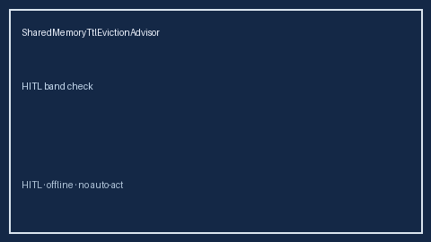

# SharedMemoryTtlEvictionAdvisor Guide



Closes AutoGen/CrewAI/LangGraph shared-memory TTL eviction advisors gaps.

Optional later polish via **GPT-5.5 / Claude Sonnet 4.6 / Gemini 3.x / Kimi K2**.

Distinct from `BlackboardEntryTtlEvictor` and `SharedMemoryQuotaGuard`.

## Usage

```python
from multi_bot_agentic.shared_memory_ttl_eviction import SharedMemoryTtlEvictionAdvisor

status = SharedMemoryTtlEvictionAdvisor().advise("session-1", expired_ratio=0.35)
assert status.requires_human_review is True
print(status.band)
```

## Safety

Always `requires_human_review=True`. No HTTP. Humans decide.
