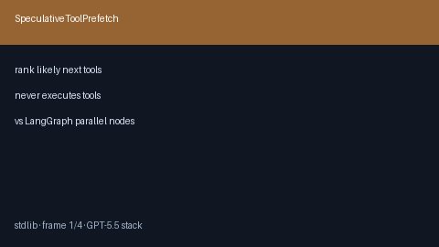

# Speculative Tool Prefetch Guide



Rank likely next tools from recent history + optional hint — **never executes**
tools. Suitable for warming adapters/caches before the next ODA step.

Works with **GPT-5.5 / Claude Sonnet 4.6 / Gemini 3.x / Kimi K2** tool loops.

## Gap vs LangGraph / CrewAI

| Capability | multi-bot-agentic | LangGraph / CrewAI |
| --- | --- | --- |
| Scope | Speculative name ranking | Parallel node / async tools |
| Execution | Never invokes tools | Usually executes |
| Wiring | Caller-driven plan | Framework-integrated |

## Usage

```python
from multi_bot_agentic.tool_prefetch import SpeculativeToolPrefetch

plan = SpeculativeToolPrefetch(max_prefetch=3).plan(
    recent_tools=["search", "checklist"],
    available_tools=["search", "checklist", "weather"],
    hint="check weather",
)
print(plan.tool_names, plan.reason)
```
