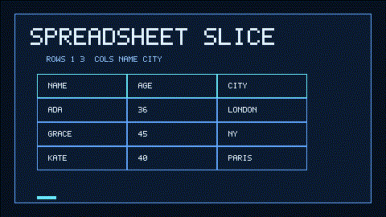

# Spreadsheet Slice Tool User Guide



## Why

Popular agent frameworks (LangGraph toolkits, OpenAI Agents SDK examples, Claude
tool-use demos) ship dedicated **spreadsheet/table slicing** helpers so the model
does not hallucinate row ranges or column offsets. **multi-bot-agentic** now
includes the same capability as a deterministic, allowlisted tool — safe for
GPT-5.5 / Claude Sonnet 4.6 / Gemini 3.x / Kimi K2 workers.

## Usage

Programmatic (separate arguments):

```python
from multi_bot_agentic.models import ToolInvocation
from multi_bot_agentic.tools.spreadsheet_slice import SpreadsheetSliceTool

result = SpreadsheetSliceTool().execute(
    ToolInvocation(
        tool_name="spreadsheet_slice",
        arguments={
            "text": "name,age,city\nAda,36,London\nGrace,45,New York\n",
            "rows": "0:1",
            "columns": ["name", 2],
        },
    )
)
print(result.content)
```

Via the decision-engine directive (single payload + sentinel):

```text
TOOL:spreadsheet_slice:name|age|city
Ada|36|London
Grace|45|New York
<<<SPREADSHEET_SLICE>>>
rows=0:1
columns=name,2
delimiter=|
```

## Row and column selection

- The first CSV row is always the header.
- Row ranges apply to **body rows only**, using zero-based, end-exclusive slice
  semantics: `rows=1:3` returns the second and third data rows.
- Use `rows=start:end`, a single row index such as `rows=2`, or separate
  `row_start` / `row_end` arguments.
- Column selections accept exact header names and/or zero-based indexes:
  `columns=["city", 0]` or `columns=city,0`.
- Header-name selections fail if the name is missing or duplicated, keeping
  slices deterministic. Index selections may still be used with duplicate names.

## Bounds

| Limit | Value |
|---|---|
| Max document chars | 20_000 |
| Max data rows | 200 |
| Max columns | 32 |
| Default delimiter | `,` |

Empty input, oversized tables, blank header cells, invalid delimiters, invalid
row ranges, out-of-bounds column indexes, missing column names, and ambiguous
column names return `ok=False` structured failures — never exceptions into the
run loop.

## Safety

Listed in `SafetyPolicy.allowed_tools` as `spreadsheet_slice`. No network, no
code execution — stdlib `csv` only. See `docs/SAFETY.md`.
