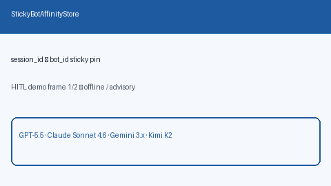

# Sticky Bot Affinity Guide



Pin `session_id` → `bot_id` so multi-bot turns stay continuous without
re-routing every message.

Works with **GPT-5.5 / Claude Sonnet 4.6 / Gemini 3.x / Kimi K2** multi-bot loops.

Distinct from:

- `BotHandoffReceiptStore` — durable **handoff audit** receipts

This module is a **sticky session affinity** map for bot continuity.

## Gap vs AutoGen / CrewAI / LangGraph

| Capability | multi-bot-agentic | AutoGen / CrewAI / LangGraph |
| --- | --- | --- |
| Focus | Session→bot sticky pin | Often reselect agent each turn |
| API | `set` / `get` / `clear` | Framework-dependent |
| Wiring | Caller-driven, no network | Often crew/graph state only |

## Usage

```python
from multi_bot_agentic.sticky_bot_affinity import StickyBotAffinityStore

store = StickyBotAffinityStore()
store.set("sess-1", "researcher")
assert store.get("sess-1").bot_id == "researcher"
store.clear("sess-1")
assert store.get("sess-1") is None
```
