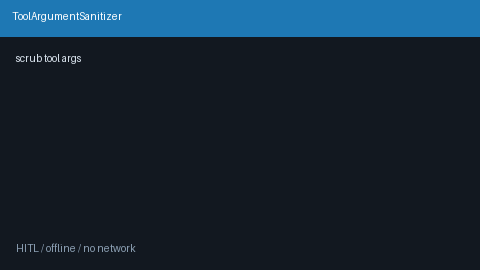

# Tool Argument Sanitizer Guide



Scrub secrets from tool **args dicts** before execute — sensitive key names
and `Bearer` / `sk-` string values become `[REDACTED]`.

Works with **GPT-5.5 / Claude Sonnet 4.6 / Gemini 3.x / Kimi K2** agent loops.

Distinct from:

- `ObservationRedactor` — observation/log **text** scrubbing
- `RedactionTool` — callable PII redaction **tool**

## Gap vs AutoGen / CrewAI

| Capability | multi-bot-agentic | AutoGen / CrewAI |
| --- | --- | --- |
| Focus | Pre-execute tool arg dict scrub | Often raw tool args verbatim |
| Key heuristics | password / secret / token / api_key / … | Framework-dependent |
| Wiring | Caller-driven `sanitize(arguments)` | Often no built-in arg scrub |

## Usage

```python
from multi_bot_agentic.argument_sanitizer import ToolArgumentSanitizer

result = ToolArgumentSanitizer().sanitize(
    {
        "api_key": "super-secret",
        "query": "status",
        "auth": {"password": "hunter2"},
        "header": "Bearer abcdEFGH1234567890xyz",
    }
)
assert result.arguments["api_key"] == "[REDACTED]"
assert result.arguments["auth"]["password"] == "[REDACTED]"
assert result.redaction_count >= 2
print(result.redacted_keys)
```
